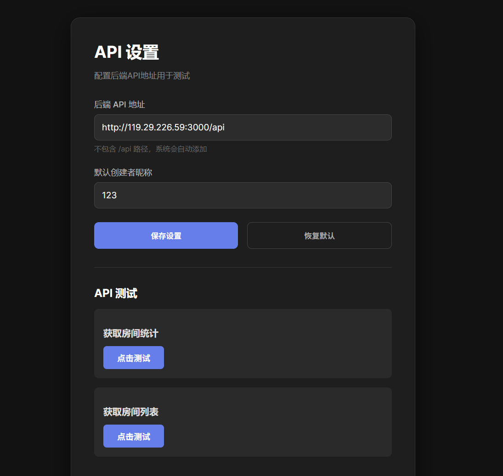

## 分支介绍

doc分支编写了文档和vpp图，以及提交了每个人的工作视频和展示视频

dev分支是 前后端代码（只提交了node的src代码和json配置文件） 以及后端API文档

## 关于打包和部署

已通过pkg打包成exe文件，online-movie-house.exe为前端，backend-online-movie-house.exe为后端，两个都启动后，浏览器访问 你的IP:5173，然后点击API设置修改后端地址进行对接, 并保存。

