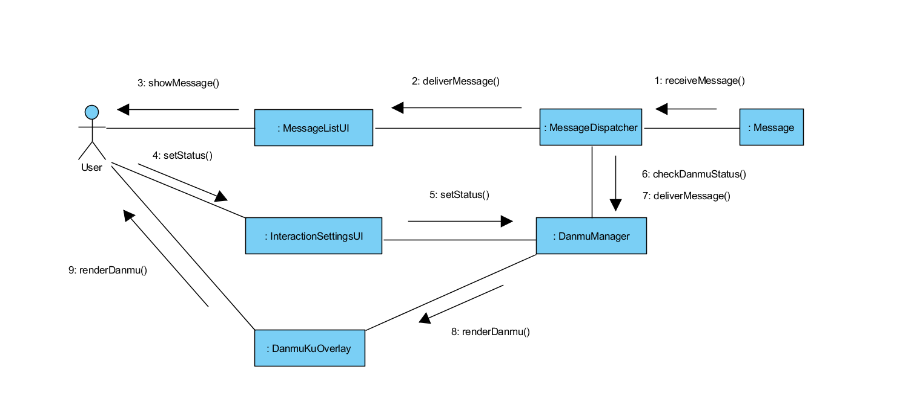
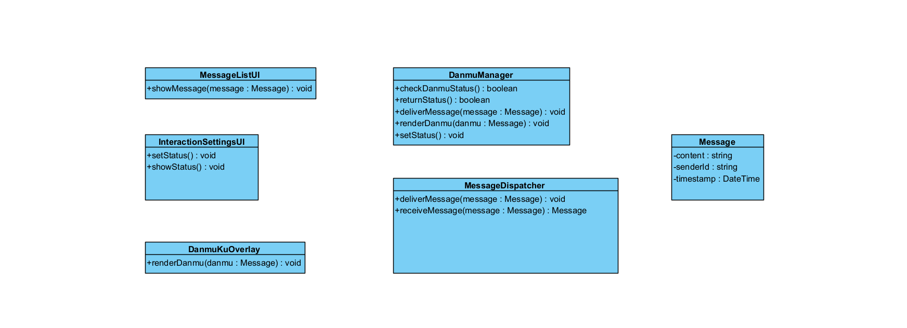
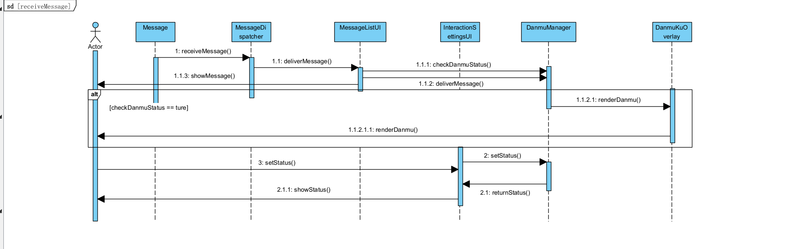

## 事件流片段的描述
### 接收聊天室的消息
1. 系统检测所有参与者的消息发送情况
2. 系统获取以下信息并且在聊天室中展示：
   * 发送者的昵称、发送时间
   * 发送的消息
3. 参与者收到消息

### 接收弹幕的消息
1. 系统检测所有参与者的消息发送情况
2. 参与者通过互动设置面板调节弹幕功能开关
3. 系统检查当前参与者弹幕功能的开启状态。
   * a: 弹幕功能开启，系统将最新的消息展示到屏幕上。
   * b: 弹幕功能关闭，则不展示消息到屏幕。

## 健壮性分析

### 边界类
1. 消息列表界面（MessageListUI）
   展现收到的消息
2. 弹幕渲染层（DanmuKuOverlay）
   在视频播放界面将消息渲染成弹幕
3. 互动设置面板（InteractionSettingsUI）
   提供弹幕功能开关

### 控制类
1. 消息分发器（MessageDispatcher）
   将消息发送给消息列表界面/弹幕渲染层
2. 弹幕管理器（DanmuManager）
   检查弹幕功能状态，开/关弹幕功能

### 实体类
1. 消息（Message）
   储存内容、发送者、时间这三种信息

## 通信图表示协作

## 类图

## 交互建模
### 顺序图
用况片段：接收消息的顺序图

