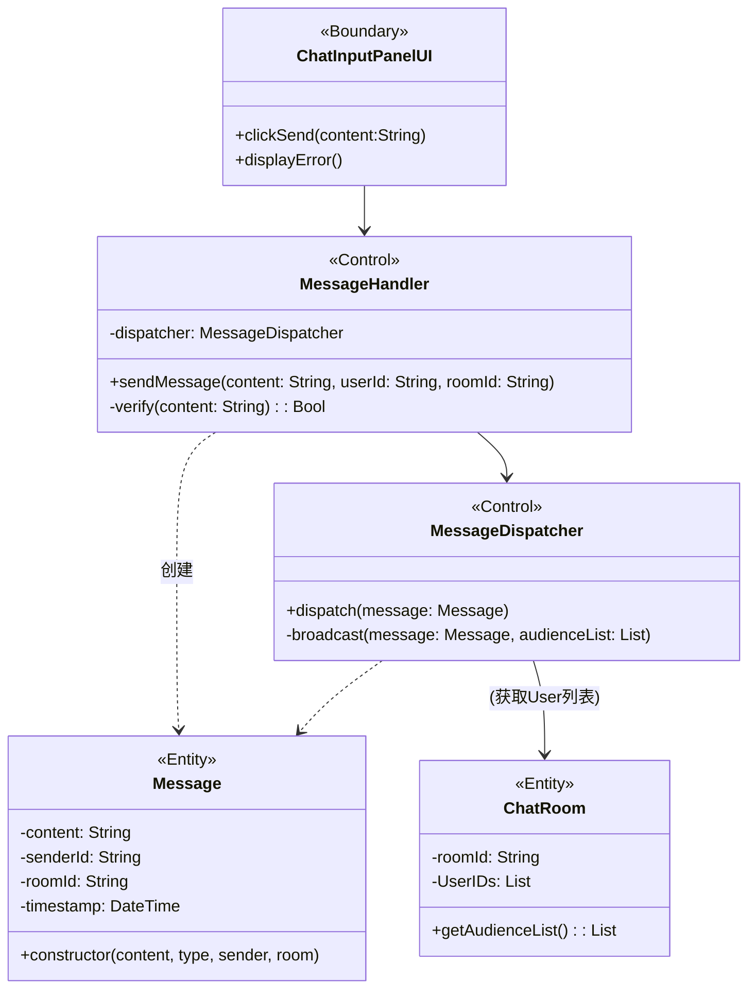
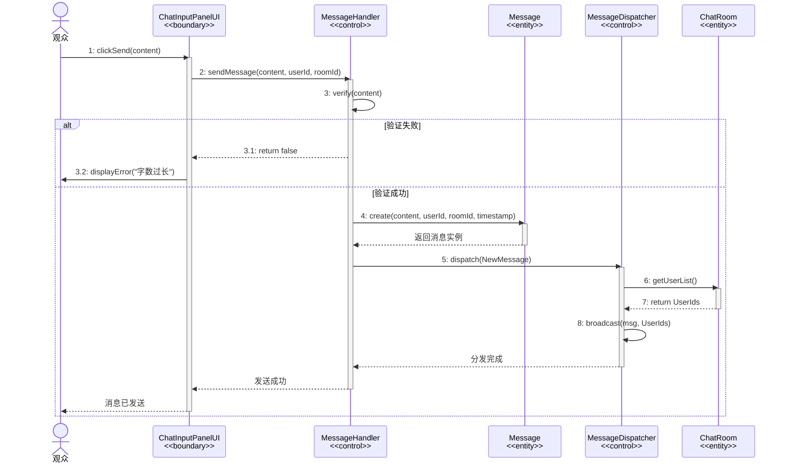

## 需求分析

### 一、用例片段：参与互动——发送消息

**范围：** 观众在消息输入框编辑并发送消息，系统验证消息内容的合规性，生成消息实体，并检索当前房间的观众列表，将消息广播给所有在线成员 。

**前置条件：** 用户已进入房间。

**1.根据UC-08 参与互动用例描述提取候选类**

```
“1.当参与者观众进入观影厅时，开始启动用例。”——> 观影厅（房间类） 观众（Audience）
“6.观众在消息输入框中编辑消息内容”——>聊天输入面板UI类

“7.观众点击发送按钮。”——>聊天输入面板UI类的职责：将输入的消息发送给系统; 消息应该不只包含内容，还应该包含发送方id，房间id（发往哪去）。所以还要有个消息实体。

"系统接收输入消息，并且执行子流“验证消息内容”。——>消息处理类，职责消息内容长度验证，验证通过后创建消息实体

“系统执行子流“广播消息”——>业务消息分发(消息分发类),职责：获取观众列表，分发所有消息给用户。

备选流中
"'验证消息内容'如果失败，则系统阻止消息发送，并且在输入框附近显示对应的错误提示。"-->消息内容过长时，边界类需要向用户提示.

```


**2.健壮性分析**

| 关键对象类型 | 类名称            | 职责                                                         |
| ------------ | ----------------- | ------------------------------------------------------------ |
| 边界对象     | ChatInputPanelUI  | **聊天输入面板**，用户与系统交互的界面，负责接收用户的输入，并将数据传递给**MessageHandler** |
| 控制对象     | MessageHandler    | **通用消息处理器**，负责协调消息的处理流程。它执行子流 S1 (验证消息内容)，如果不合法则拒绝，合法则实例化消息对象 。 |
| 控制对象     | MessageDispatcher | **通用消息分发器**，负责执行子流 S2 (广播消息)。它需要获取接收者列表并将消息分发出去 。 |
| 实体对象     | Message           | 封装消息数据（内容、发送者、时间戳、房间号）。               |
| 实体对象     | ChatRoom          | 维护当前房间的状态，特别是 **子流S2** 中提到的“获取当前观影厅聊天室中的观众列表”需要访问此实体 。 |


**3.健壮性交互流程**

1. 用户在 `ChatInputPanelUI` 点击发送。
2. UI 通知 `MessageHandler` 处理。
3. `MessageHandler` 验证内容 (Subflow S1: 长度<=1024)
4. 验证通过后，`MessageHandler` 创建 `Message` 实体。
5. `MessageHandler` 调用 `MessageDispatcher` 进行分发。
6. `MessageDispatcher` 向 `ChatRoom` 实体请求当前观众列表 (Subflow S2) 。
7. `MessageDispatcher` 执行广播。


#### 交互建模

**通信图**


#### 通信图->类图





#### 顺序图



### 二、用例片段：参与互动——接收消息

**范围：** 系统接收消息，检测当前弹幕功能的状态，然后将消息传递给对应界面进行渲染。

**1.根据UC-08 参与互动用例描述提取候选类**

```
“系统检测所有参与者的消息发送情况”——>消息监听类（MessageListener）、消息类（Message）、观众（Audience）
“参与者通过互动设置面板调节弹幕功能开关”——>互动设置面板类（InteractionSettingsUI）
“弹幕功能的开启状态”——>弹幕管理类（DanmuManager）
“系统获取以下信息并且在聊天室中展示”。——>消息列表界面类（MessageListUI）
“弹幕功能开启，系统将最新的消息展示到屏幕上”——>弹幕界面类（DanmuUI）
```


**2.健壮性分析**

| 关键对象类型 | 类名称            | 职责                                                         |
| ------------ | ----------------- | ------------------------------------------------------------ |
| 边界对象     | InteractionSettingsUI | **互动设置面板**，用户与系统交互的界面，负责展示弹幕功能的开关状态、传递弹幕功能开关状态改变信息 |
| 控制对象     | DanmuManager | **弹幕管理器**，负责检查、设置弹幕功能状态，传递消息给弹幕界面进行渲染 。 |
| 边界对象     | MessageListUI | **消息列表界面**，负责在聊天室中渲染所有消息 。 |
| 实体对象     | Message           | 封装消息数据（内容、发送者、时间戳）。    |
| 边界对象     | DanmuUI          | **弹幕界面**，负责将消息渲染成弹幕。 |
| 控制对象     | MessageListener    | **消息监听器**，负责接收并创建消息实体，并将消息在系统内传递|


**3.健壮性交互流程**

1. `MessageListener`接收并且创建`Message`实体
2. 参与者通过`InteractionSettingsUI`设置弹幕功能状态
3. `MessageListener`将创建的`Message`传递给`DanmuManager`、`MessageListUI`
4. `MessageListUI`渲染消息，`DanmuManager`检查弹幕功能状态，并向`DanmuUI`传递渲染弹幕的指令
5. 如果弹幕功能开启，`DanmuUI`渲染弹幕

#### 交互建模

**接收消息的通信图**

**通信图——>类图**

**接收消息的顺序图**


### 整合类图


