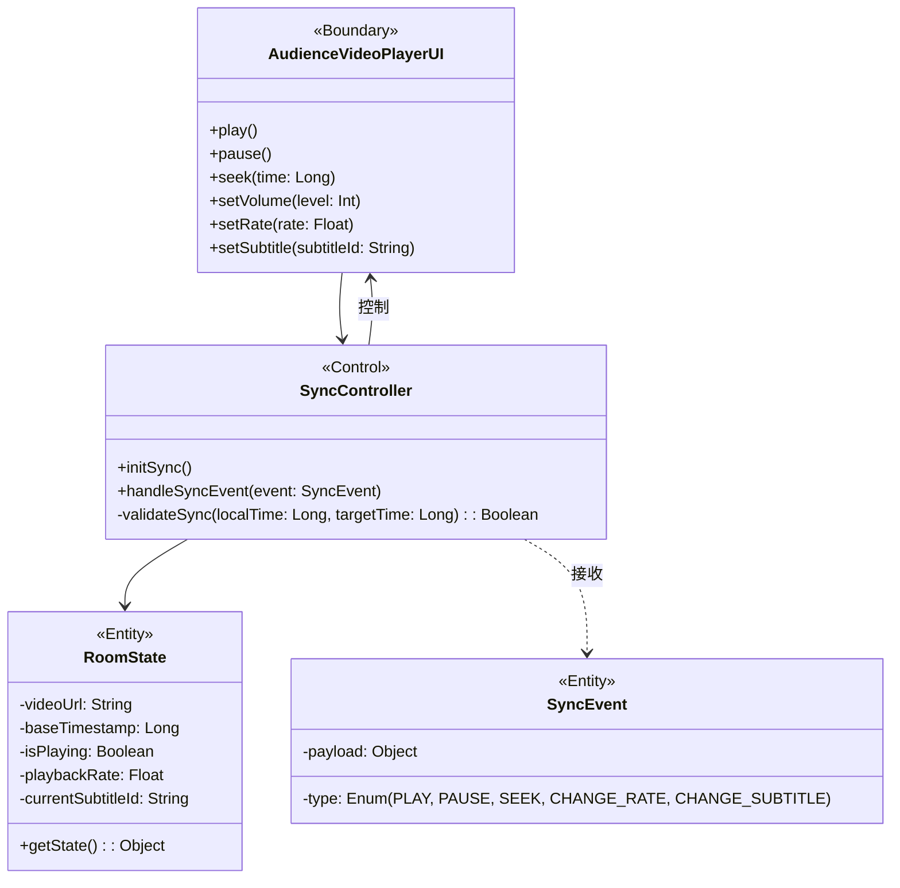
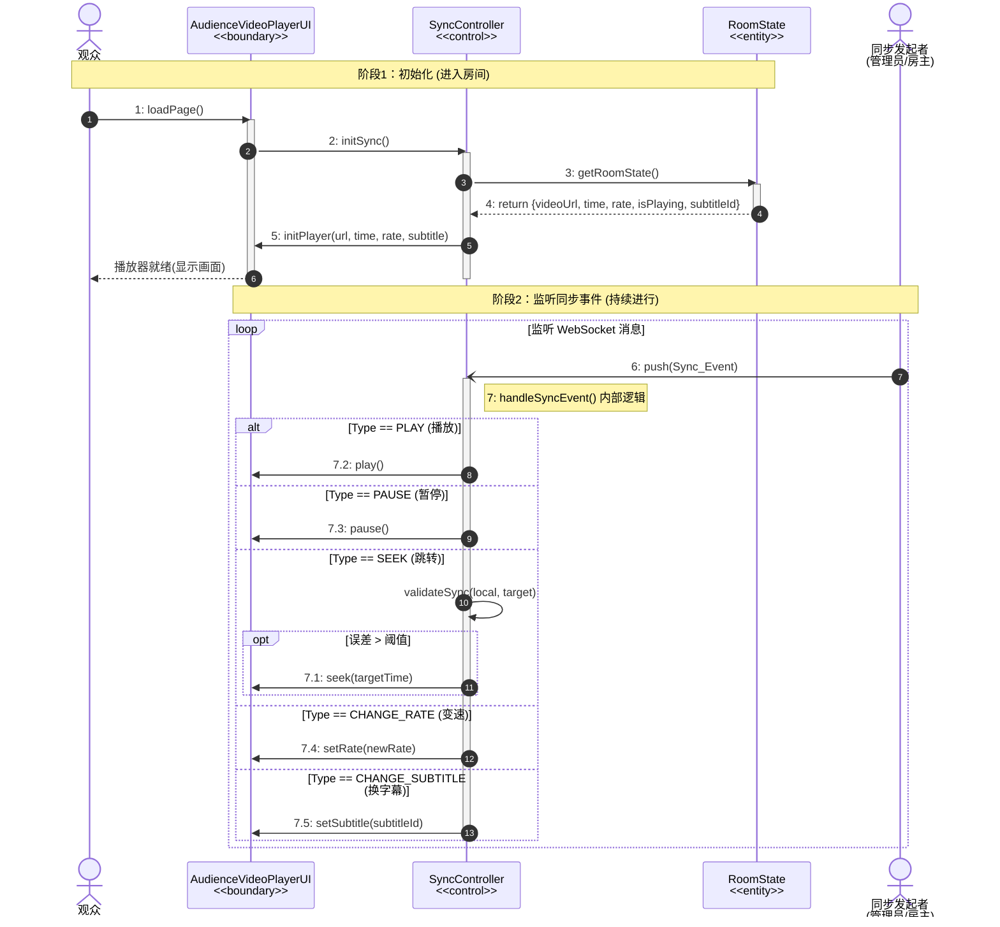

### 需求分析

#### 用例片段：协同观影

**范围：** 观众进入房间后，系统初始化本地播放器状态，并持续监听服务端的同步指令（Sync_Event），确保本地播放进度、状态、倍速等与房间保持一致；同时允许观众调整本地视听属性（音量、清晰度）。

**前置条件：** 观众已成功加入观影室，且与服务器建立了活跃的实时通信连接。


**1. 根据UC-07 协同观影用例描述提取候选类**

```text
“1.当观众的浏览器完成播放器组件的加载时，用例启动”——> 观众播放器界面（AudienceVideoPlayerUI）

“2.系统检索当前房间的房间状态对象”——> 房间状态实体（RoomState），包含当前播放的视频、进度、状态、倍率、字幕等信息。

“5.进入同步监听状态...等待接收 Sync_Event”——> 同步控制器（SyncController），职责：监听网络事件，解析指令。

“6.执行子流S2：处理同步指令...系统强制将播放进度重置为目标时间戳”——> 同步控制器需调用播放器界面的接口（如 seek, play, pause，换倍率，换字幕）。

备选流A2中：
“计算出本地时间戳与目标时间戳的差值超过同步阈值...系统强制执行‘Seek’操作”——> 同步控制器需要包含校验逻辑（validateSync）。
```


| **关键对象类型** | **类名称**            | **职责**                                                     |
| ---------------- | --------------------- | ------------------------------------------------------------ |
| 边界对象         | AudienceVideoPlayerUI | **观众播放器界面**，负责视频渲染、加载字幕、响应用户的本地设置（音量/清晰度），并提供供控制器调用的接口（但观众只有调节音量和播放暂停的权限）。 |
| 控制对象         | SyncController        | **同步控制器**，负责核心同步逻辑。它在初始化时获取房间状态，监听 `Sync_Event`，解析指令（PAUSE/PLAY/SEEK/CHANGE_RATE/CHANGE_SUBTITLE） |
| 实体对象         | RoomState             | **房间状态对象**，维护房间的“唯一真实数据源”（视频源标识、基准时间戳、倍速、播放状态、字幕）。 |
| 实体对象         | SyncEvent             | **同步事件实体**，封装服务端下发的指令数据（类型、Payload）。 |


**3. 健壮性交互流程**

1. 观众加载 `AudienceVideoPlayerUI`。
2. UI 通知 `SyncController` 进行初始化。
3. `SyncController` 请求 `RoomState` 获取当前房间播放状态。
4. `SyncController` 根据状态调用 `AudienceVideoPlayerUI` 加载视频、设置进度和倍速。
5. `SyncController` 开始监听服务端消息。
6. 当收到 `Sync_Event` 时，`SyncController` 解析指令类型 (Subflow S2)。
7. `SyncController` 调用 `AudienceVideoPlayerUI` 执行相应操作（如暂停、跳转）。


#### 3. 交互建模

**通信图**


**通信图->类图**



**validateSync(LocalTime，targetTime)操作用于防抖动与阈值判断**：收到服务端的同步指令（特别是时间相关的指令，如周期性的校准或 SEEK 指令）时，若targetTime - LocalTime的绝对值小于x，则可以选择不同步，以提升观看体验。 


**顺序图**




