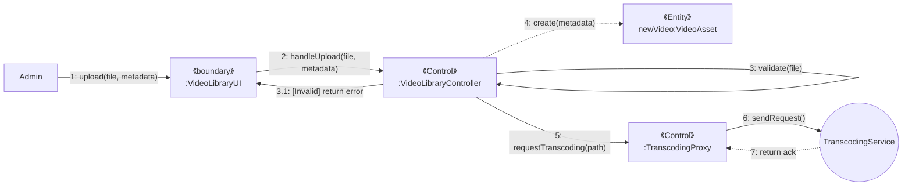
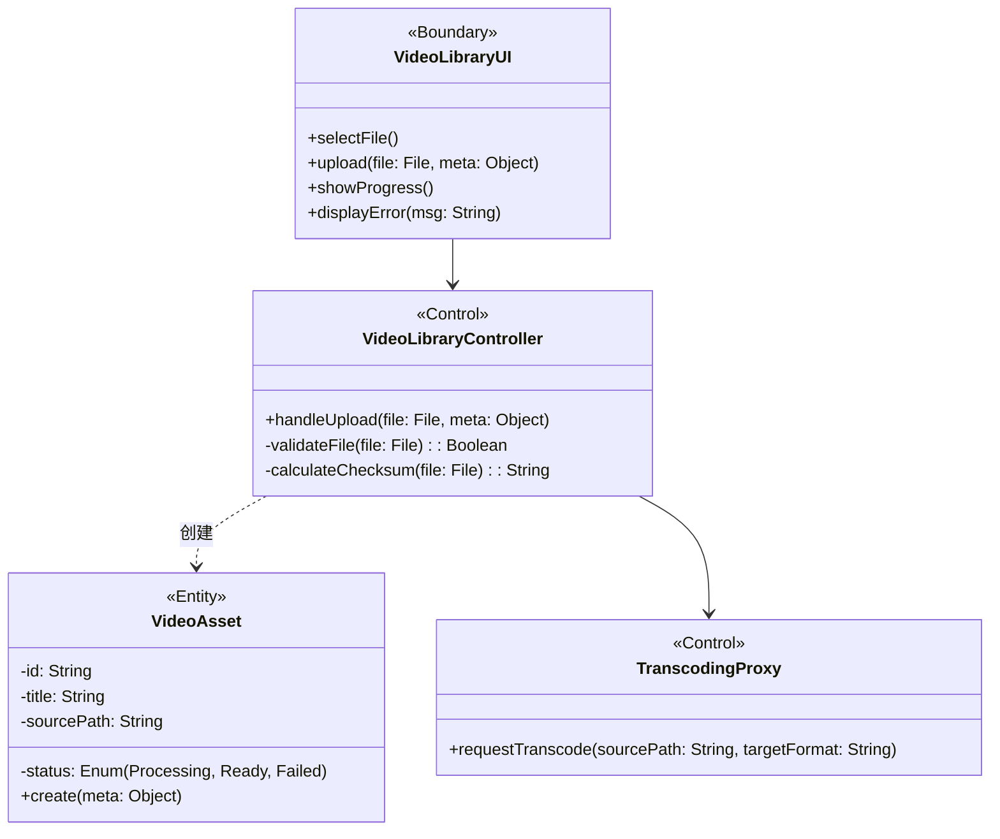
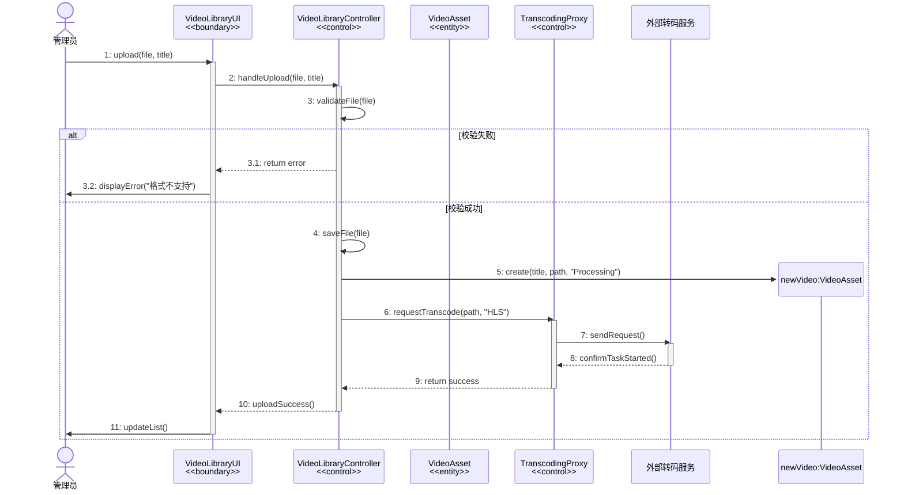
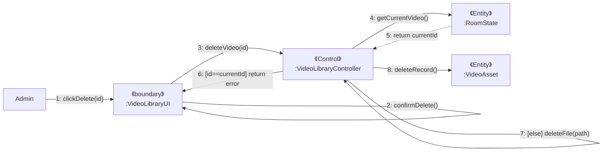
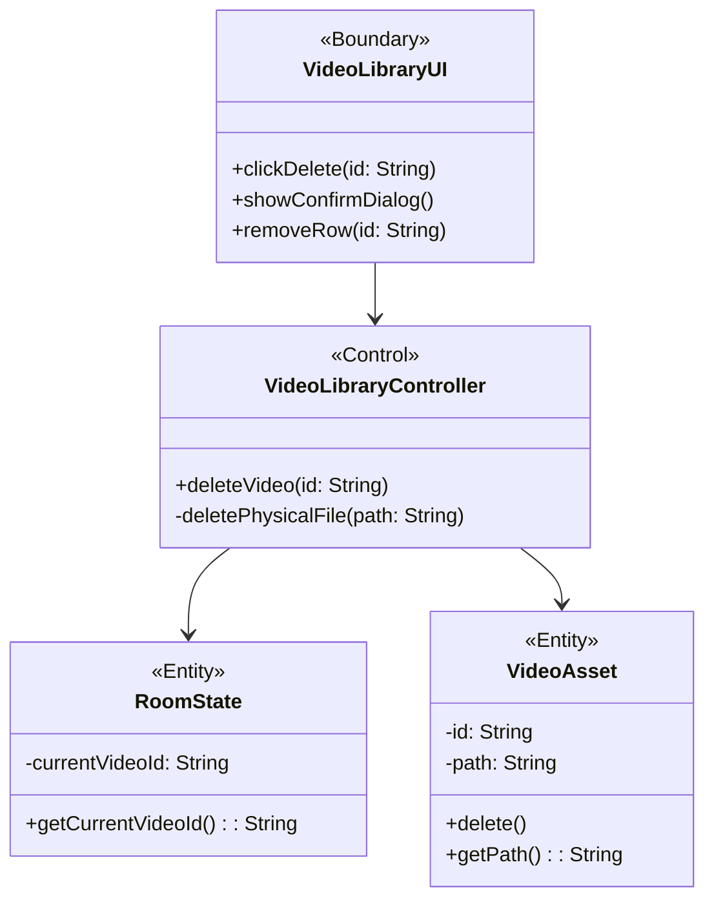
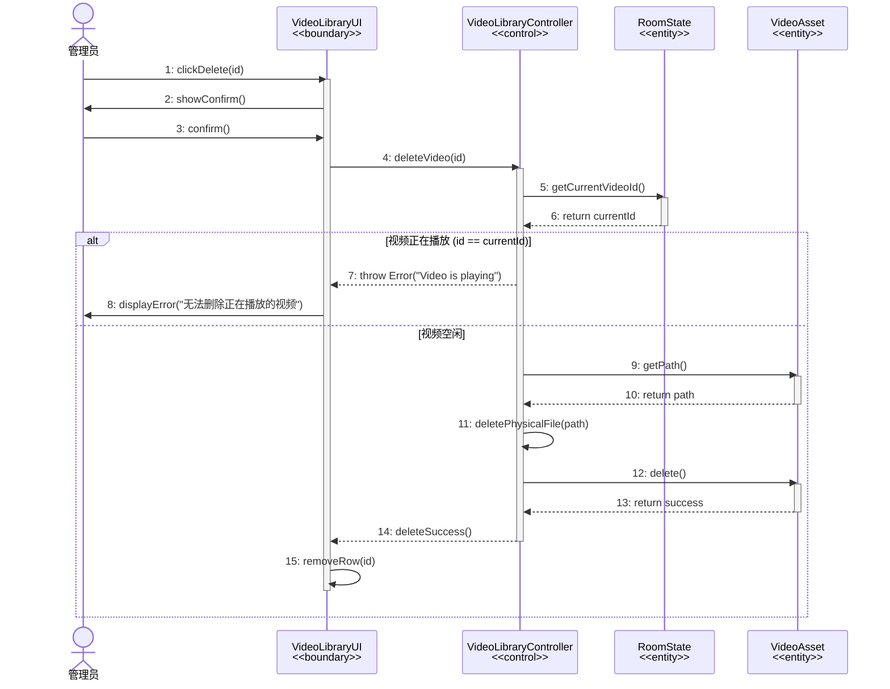
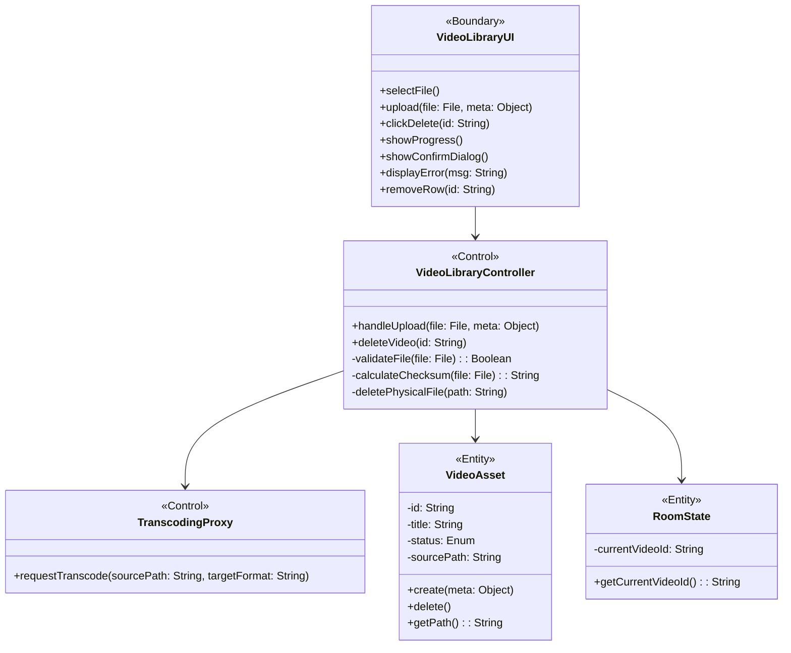

# 需求分析 - 管理视频库（上传视频）

## 1. 用例片段：管理视频库——上传视频

**范围：** 房间管理员通过系统上传本地视频文件。系统验证文件格式与完整性，在数据库中创建视频资产记录，并请求外部转码服务将视频转换为流媒体格式（HLS）。

**前置条件：**房间管理员已登录并拥有当前房间的“资源管理权限”，且系统存储空间充足。

## 2. 候选类提取 (基于UC-05描述)

- “4.发起上传请求：管理员向系统提交上传新视频的请求”——> **视频库界面 (VideoLibraryUI)**
- “5.执行子流 S1：验证与接收文件”——> **视频库控制器 (VideoLibraryController)**，职责：执行权限验证、格式校验、完整性校验。
- “6.创建资产记录...将其状态初始化为‘转码中’”——> **视频资产实体 (VideoAsset)**，封装视频元数据（标题、状态、路径）。
- “7.请求转码：系统向外部参与者片源转码服务发送异步处理请求”——> **转码服务代理 (TranscodingProxy)**，职责：封装与外部系统的通信接口。
- 外部参与者：**视频转码服务**

## 3. 健壮性分析

| 关键对象类型 | 类名称               | 职责                                                         |
| :----------- | :------------------- | :----------------------------------------------------------- |
| 边界对象     | **VideoLibraryUI**   | **视频库界面**，提供文件选择、上传进度展示、错误提示，以及接收用户的上传指令。 |
| 控制对象     | **VideoLibraryController**  | **视频库控制器**，协调上传全流程。执行子流S1（校验文件格式、大小、计算校验和），调用实体创建记录，并调度转码代理。 |
| 控制对象     | **TranscodingProxy** | **转码服务代理**，作为系统与外部“视频转码服务”的接口，负责发送转码请求并接收任务启动回执。 |
| 实体对象     | **VideoAsset**       | **视频资产**，存储视频的元数据（ID、标题、存储路径、处理状态）。 |

**健壮性交互流程：**

1. 管理员在 `VideoLibraryUI` 选择文件并点击上传。
2. UI 调用 `VideoLibraryController` 处理上传请求。
3. `VideoLibraryController` 执行校验逻辑（Subflow S1）：检查格式白名单、文件大小、计算校验和。
4. 校验通过后，`VideoLibraryController` 创建一个新的 `VideoAsset` 实体，状态设为“Processing”。
5. `VideoLibraryController` 调用 `TranscodingProxy` 请求外部服务进行转码。
6. `TranscodingProxy` 收到外部服务确认后，返回结果。
7. `VideoLibraryController` 通知 UI 刷新列表。

## 4. 交互建模

### 4.1 通信图




### 4.2类图



### 4.3顺序图




---


### 2. 管理视频库——删除视频场景

#### 用例片段：管理视频库——删除视频

**范围：** 管理员请求删除指定的视频资源。系统需先验证该视频是否正在被房间播放，若未播放则执行物理文件删除和逻辑记录销毁。

**前置条件：** 管理员已登录，且视频库中存在目标视频。

**1. 根据UC-05 管理视频库（备选流A1 删除）用例描述提取候选类**

 ```text
 “1.系统验证该视频是否正在‘当前播放’状态”——> 房间状态实体（RoomState），维护当前正在播放的资源ID。
 “4.系统执行物理删除操作...5.系统执行逻辑删除操作”——> 视频库控制器（VideoLibraryController），协调检查与删除逻辑。
 “5.销毁对应的视频资产记录”——> 视频资产实体（VideoAsset）。
 
 ```

**2. 健壮性分析**

| **关键对象类型** | **类名称**          | **职责**                                                     |
| ---------------- | ------------------- | ------------------------------------------------------------ |
| 边界对象         | **VideoLibraryUI**  | **视频库界面**，提供删除按钮，显示确认对话框及操作结果。     |
| 控制对象         | **VideoLibraryController** | **视频库控制器**，负责删除逻辑的核心协调。先检查 `RoomState` 确认占用情况，再执行文件系统的物理删除和数据库的逻辑删除。 |
| 实体对象         | **RoomState**       | **房间状态**，记录当前房间正在播放的 `currentVideoId`，用于依赖检查。 |
| 实体对象         | **VideoAsset**      | **视频资产**，代表视频数据记录，响应删除操作。               |

**3. 健壮性交互流程**

1. 管理员在 `VideoLibraryUI` 点击删除。
2. UI 弹出确认提示，管理员确认。
3. UI 调用 `VideoLibraryController` 执行删除。
4. `VideoLibraryController` 访问 `RoomState` 检查目标视频是否为 `currentVideoId`。
5. 若正在播放，返回错误提示。
6. 若未播放，`VideoLibraryController` 删除磁盘文件。
7. `VideoLibraryController` 调用 `VideoAsset` 销毁数据库记录。
8. UI 刷新列表。


#### 3. 交互建模

**通信图**



**通信图->类图**




**顺序图**



### 4. 合并后的类图 (管理视频库：上传与删除)



