# 需求分析

## 用例：主持放映

### 1. 从用例筛选候选类

#### 1.1 候选类提取

- 从用例"主持放映"描述中识别候选类：

| 候选类                            | 提取来源               | 筛选问题                         |
| --------------------------------- | ---------------------- | -------------------------------- |
| RoomState（房间状态）             | “系统更新房间状态”     | 需要持久化房间状态吗？           |
| OperationLog（操作日志）          | “系统记录操作日志”     | 需要记录管理员操作吗？           |
| Admin（管理员）（存在疑问）       | “管理员请求播放/暂停”  | 管理员没有持久化存储信息是类吗？ |
| PlayControlUI（管理员操作界面）   | “管理员通过界面控制”   | 需要专门的交互界面吗？           |
| PlaybackController（放映控制）        | “系统处理播放控制请求” | 需要协调多个对象吗？             |
| SyncEvent（同步事件）（存在疑问） | “系统发送同步事件”     | 同步事件是否需要持久化存储？     |


### 2. 分析边界、控制、实体类

#### 2.1 分类标准

- 边界类：处理系统与外部参与者的交互
- 控制类：协调用例流程，管理业务逻辑
- 实体类：代表持久化业务数据

#### 2.2 最终分类结果

| 类别   | 类名称         | 理由                                                     |
| ------ | -------------- | -------------------------------------------------------- |
| 边界类 | PlayControlUI  | 管理员与系统交互的界面，提供播放控制功能                 |
| 控制类 | PlaybackController | 协调播放控制的业务逻辑，处理管理员请求                   |
| 实体类 | RoomState      | 存储视频播放状态（`playbackPosition` / `isPlaying` / `playbackRate` / `currentVideoId` / `currentSubtitleId`） |
| 实体类 | OperationLogs  | 记录管理员操作的操作日志集合                             |
| 实体类 | OperationLog   | （单个操作日志）                                         |


- 为什么不包含管理员：管理员在该用例中仅作为外部参与者，触发系统功能，并没有需要持久化存储的信息，不作为实体类，不符合实体类、边界类或控制类的定义
- 为什么不包含同步事件：同步事件在该用例中仅作为系统内部通信，不涉及持久化存储，也不作为实体类，不符合实体类、边界类或控制类的定义

### 3. 职责分配与对象协作分析

- 为确保用例中的每个步骤都有明确的对象负责，我们对对象间的协作关系进行分析：

#### 3.1 播放/暂停（取自主持放映的一部分）场景的对象协作

| 步骤                    | 涉及的类       | 协作的类       | 职责说明                           |
| ----------------------- | -------------- | -------------- | ---------------------------------- |
| 1. 管理员请求播放/暂停  | PlayControlUI  | -              | 接收管理员（参与者）的界面操作输入 |
| 2. 系统处理播放控制请求 | PlaybackController | PlayControlUI  | 协调业务流程，处理控制请求         |
| 3. 更新视频状态         | RoomState      | PlaybackController | 改变播放状态并记录变更             |
| 4. 发送同步事件         | -              | PlaybackController | 发送同步事件通知其他客户端         |
| 5. 记录操作日志         | OperationLogs  | PlaybackController | 创建并保存操作日志记录             |
| 6. 显示操作结果         | PlayControlUI  | -              | 向管理员（参与者）反馈操作结果     |

### 4. 交互建模

#### 4.1 描述对象之间的交互

首先实例化控制对象，并获取当前RoomState的信息，再初始化播放控制界面。假定房间管理员要求边界对象更改视频状态。控制对象结合RoomState的信息和管理员请求操作的具体内容判断请求是否符合业务规则，符合则向RoomState要求改变状态，并发送同步事件，再要求OperationLogs添加此次操作的记录。最后控制对象要求边界对象显示操作成功与否。

#### 4.2 协作对象的职责分配

RoomState应该负责视频状态的实际改变；OperationLogs负责记录操作日志；边界对象负责接收管理员操作请求并告知控制对象，以及显示操作结果；控制对象负责判断请求的业务合规性，协调分配RoomState和OperationLogs的任务，以及发送同步事件。

#### 4.3 通信图

*注：setRoomState()实际涵盖setPlaybackPosition()、setPlaybackRate()、togglePlayback()、setCurrentVideoId()、setSubtitle()等操作。


#### 4.4 类图推导

#### 4.4.1 识别类的属性和操作


### PlayControlUI (边界类)

**职责：** 提供管理员操作界面，接收外部参与者输入，显示操作结果  
**操作：**

- `+startInterface()`: 启动播放控制界面
- `+togglePlayback()`: 向控制类请求处理播放/暂停请求
- `+setPlaybackRate()`: 向控制类请求设置播放速度
- `+setPlaybackPosition()`: 向控制类请求设置播放进度
- `+setCurrentVideoId()`: 向控制类请求设置视频源
- `+setSubtitle()`: 向控制类请求设置字幕
- `+showResult()`: 显示操作结果

### PlaybackController (控制类)

**职责：** 协调播放控制业务逻辑，处理各种播放控制请求  
**操作：**

- `+togglePlayback()`: 协调处理播放/暂停逻辑
- `+setPlaybackRate()`: 协调处理播放速度调整
- `+setPlaybackPosition()`: 协调处理播放进度调整
- `+setCurrentVideoId()`: 协调处理视频源切换
- `+setSubtitle()`: 协调处理字幕设置
- `+logOperation()`: 协调记录操作日志
- `+sendSyncEvent()`: 发送同步事件

### RoomState (实体类)

**职责：** 存储和维护视频播放状态信息  
**属性：**

- `-playbackPosition`: 当前播放进度
- `-isPlaying: boolean`: 播放状态
- `-playbackRate: float`: 播放速度
- `-currentVideoId`: 视频源
- `-currentSubtitleId`: 当前字幕源

**操作：**

- `+togglePlayback()`: 切换播放/暂停状态
- `+setPlaybackRate()`: 设置播放速度
- `+setPlaybackPosition()`: 设置播放进度
- `+setCurrentVideoId()`: 设置视频源
- `+setSubtitle()`: 设置字幕
- `+getState()`: 获取当前视频状态

### OperationLogs (实体类)

**职责：** 管理操作日志的集合，提供日志记录功能  
**属性：**

- `-logs`: 操作日志列表

**操作：**

- `+logOperation()`: 记录操作日志

### OperationLog (实体类)

**职责：** 记录单个操作的详细信息  
**属性：**

- `-operationType`: 操作类型
- `-operationTime`: 操作时间

#### 4.4.2 识别类之间的关系

| 关系类型 | 类A            | 类B            | 多重性 | 描述                                  |
| -------- | -------------- | -------------- | ------ | ------------------------------------- |
| 关联     | PlayControlUI  | PlaybackController | 1对1   | UI向控制器发送控制请求                |
| 关联     | PlaybackController | RoomState      | 1对1   | 控制器协调更新视频状态                |
| 关联     | PlaybackController | OperationLogs  | 1对1   | 控制器协调记录操作日志                |
| 组合     | OperationLogs  | OperationLog   | 1对多  | OperationLogs包含多个OperationLog对象 |


### **最终类图**：

 

#### 4.5 顺序图

#### 4.5.1 顺序图设计

- 下面为主持放映（切换播放状态、设置进度条）顺序图

  

---
## 用例：协同观影

**范围：** 观众进入房间后，系统初始化本地播放器状态，并持续监听服务端的同步指令（Sync_Event），确保本地播放进度、状态、倍速等与房间保持一致；同时允许观众调整本地视听属性（音量、清晰度）。

**前置条件：** 观众已成功加入观影室，且与服务器建立了活跃的实时通信连接。


### 1. 根据UC-07 协同观影用例描述提取候选类

```text
“1.当观众的浏览器完成播放器组件的加载时，用例启动”——> 观众播放器界面（AudienceVideoPlayerUI）

“2.系统检索当前房间的房间状态对象”——> 房间状态实体（RoomState），包含当前播放的视频、进度、状态、倍率、字幕等信息。

“5.进入同步监听状态...等待接收 Sync_Event”——> 同步控制器（SyncController），职责：监听网络事件，解析指令。

“6.执行子流S2：处理同步指令...系统强制将播放进度重置为目标时间戳”——> 同步控制器需调用播放器界面的接口（如 seek, play, pause，换倍率，换字幕）。

备选流A2中：
“计算出本地时间戳与目标时间戳的差值超过同步阈值...系统强制执行‘Seek’操作”——> 同步控制器需要包含校验逻辑（validateSync）。
```


### 2. 健壮性分析

| **关键对象类型** | **类名称**            | **职责**                                                     |
| :--------------- | --------------------- | ------------------------------------------------------------ |
| 边界对象         | AudienceVideoPlayerUI | **观众播放器界面**，负责视频渲染、加载字幕、响应用户的本地设置（音量/清晰度），并提供供控制器调用的接口（但观众只有调节音量和播放暂停的权限）。 |
| 控制对象         | SyncController        | **同步控制器**，负责核心同步逻辑。它在初始化时获取房间状态，监听 `Sync_Event`，解析指令（PAUSE/PLAY/SEEK/CHANGE_RATE/CHANGE_SUBTITLE） |
| 实体对象         | RoomState             | **房间状态对象**，维护房间的“唯一真实数据源”（`currentVideoId`、`playbackPosition`、`playbackRate`、`isPlaying`、`currentSubtitleId`）。 |
| 实体对象         | SyncEvent             | **同步事件实体**，封装服务端下发的指令数据（类型、Payload）。 |


### 3. 健壮性交互流程

1. 观众加载 `AudienceVideoPlayerUI`。
2. UI 通知 `SyncController` 进行初始化。
3. `SyncController` 请求 `RoomState` 获取当前房间播放状态。
4. `SyncController` 根据状态调用 `AudienceVideoPlayerUI` 加载视频、设置进度和倍速。
5. `SyncController` 开始监听服务端消息。
6. 当收到 `Sync_Event` 时，`SyncController` 解析指令类型 (Subflow S2)。
7. `SyncController` 调用 `AudienceVideoPlayerUI` 执行相应操作（如暂停、跳转）。


#### 4. 交互建模

**通信图**

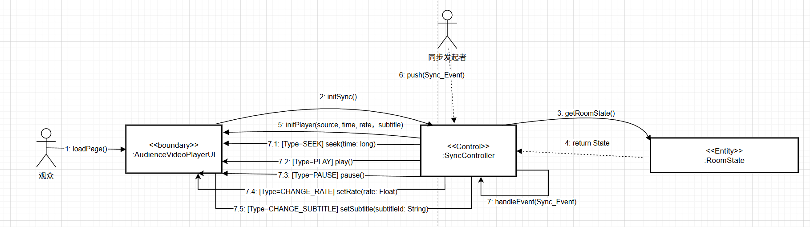


**通信图->类图**

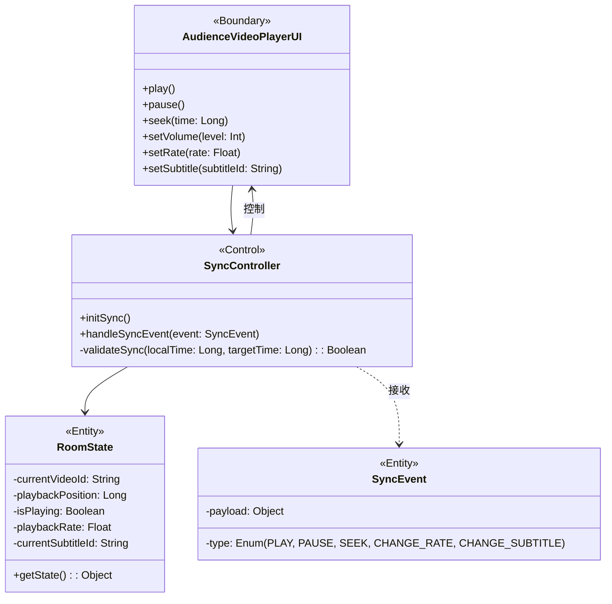
```mermaid
classDiagram
    class AudienceVideoPlayerUI {
    	<<Boundary>>
        +play()
        +pause()
        +seek(time: Long)
        +setVolume(level: Int)
        +setRate(rate: Float)
        +setSubtitle(subtitleId: String)
    }

    class SyncController {
    	<<Control>>
        +initSync()
        +handleSyncEvent(event: SyncEvent)
        -validateSync(localTime: Long, targetTime: Long): Boolean
    }


    class RoomState {
    	<<Entity>>
        -currentVideoId: String
        -playbackPosition: Long
        -isPlaying: Boolean
        -playbackRate: Float
        -currentSubtitleId: String
        +getState(): Object
    }

    class SyncEvent {
    	<<Entity>>
        -type: Enum (PLAY, PAUSE, SEEK, CHANGE_RATE, CHANGE_SUBTITLE)
        -payload: Object
    }

    %% 关系定义
    AudienceVideoPlayerUI --> SyncController
    SyncController --> RoomState
    SyncController ..> SyncEvent : 接收
    SyncController --> AudienceVideoPlayerUI : 控制
```

**validateSync(LocalTime，targetTime)操作用于防抖动与阈值判断**：收到服务端的同步指令（特别是时间相关的指令，如周期性的校准或 SEEK 指令）时，若targetTime - LocalTime的绝对值小于x，则可以选择不同步，以提升观看体验。 


**顺序图**

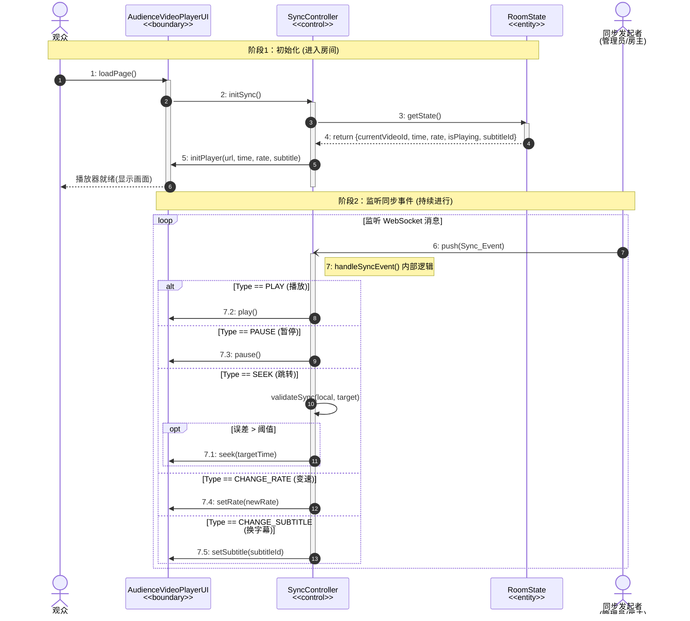
```mermaid
sequenceDiagram
    autonumber
    actor Audience as 观众
    participant UI as AudienceVideoPlayerUI<br/><<boundary>>
    participant Controller as SyncController<br/><<control>>
    participant Room as RoomState<br/><<entity>>
    actor SyncInitiator as 同步发起者<br/>(管理员/房主)

    %% === 第一阶段：初始化 ===
    Note over Audience, Room: 阶段1：初始化 (进入房间)
    Audience->>UI: 1: loadPage()
    activate UI
    
    UI->>Controller: 2: initSync()
    activate Controller
    
    Controller->>Room: 3: getState()
    activate Room
    Room-->>Controller: 4: return {currentVideoId, time, rate, isPlaying, subtitleId}
    deactivate Room
    
    Controller->>UI: 5: initPlayer(url, time, rate, subtitle)
    UI-->>Audience: 播放器就绪(显示画面)
    deactivate Controller
    deactivate UI

    %% === 第二阶段：同步监听 ===
    Note over SyncInitiator, UI: 阶段2：监听同步事件 (持续进行)
    
    loop 监听 WebSocket 消息
        SyncInitiator-)Controller: 6: push(Sync_Event)
        activate Controller
        
        Note right of Controller: 7: handleSyncEvent() 内部逻辑
        
        alt Type == PLAY (播放)
            Controller->>UI: 7.2: play()
            
        else Type == PAUSE (暂停)
            Controller->>UI: 7.3: pause()
            
        else Type == SEEK (跳转)
            Controller->>Controller: validateSync(local, target)
            opt 误差 > 阈值
                Controller->>UI: 7.1: seek(targetTime)
            end
            
        else Type == CHANGE_RATE (变速)
            Controller->>UI: 7.4: setRate(newRate)
            
        else Type == CHANGE_SUBTITLE (换字幕)
            Controller->>UI: 7.5: setSubtitle(subtitleId)
        end
        
        deactivate Controller
    end
```

### 合并分析类图

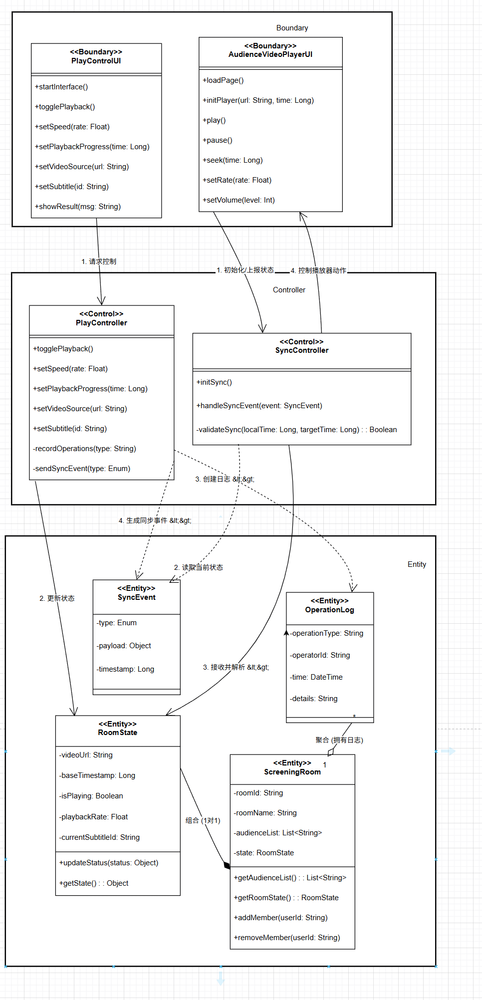

---

## 用例：管理视频库

### 1. 用例片段：管理视频库——上传视频

**范围：** 房间管理员通过系统上传本地视频文件。系统验证文件格式与完整性，在数据库中创建视频资产记录，并请求外部转码服务将视频转换为流媒体格式（HLS）。

**前置条件：**房间管理员已登录并拥有当前房间的“资源管理权限”，且系统存储空间充足。

### 2. 候选类提取 (基于UC-05描述)

- “4.发起上传请求：管理员向系统提交上传新视频的请求”——> **视频库界面 (VideoLibraryUI)**
- “5.执行子流 S1：验证与接收文件”——> **视频库控制器 (VideoLibraryController)**，职责：执行权限验证、格式校验、完整性校验。
- “6.创建资产记录...将其状态初始化为‘转码中’”——> **视频资产实体 (VideoAsset)**，封装视频元数据（标题、状态、路径）。
- “7.请求转码：系统向外部参与者片源转码服务发送异步处理请求”——> **转码服务代理 (TranscodingController)**，职责：封装与外部系统的通信接口。
- 外部参与者：**视频转码服务**

### 3. 健壮性分析

| 关键对象类型 | 类名称                     | 职责                                                         |
| :----------- | :------------------------- | :----------------------------------------------------------- |
| 边界对象     | **VideoLibraryUI**         | **视频库界面**，提供文件选择、上传进度展示、错误提示，以及接收用户的上传指令。 |
| 控制对象     | **VideoLibraryController** | **视频库控制器**，协调上传全流程。执行子流S1（校验文件格式、大小、计算校验和），调用实体创建记录，并调度转码代理。 |
| 控制对象     | **TranscodingController**       | **转码服务代理**，作为系统与外部“视频转码服务”的接口，负责发送转码请求并接收任务启动回执。 |
| 实体对象     | **VideoAsset**             | **视频资产**，存储视频的元数据（ID、标题、存储路径、处理状态）。 |

**健壮性交互流程：**

1. 管理员在 `VideoLibraryUI` 选择文件并点击上传。
2. UI 调用 `VideoLibraryController` 处理上传请求。
3. `VideoLibraryController` 执行校验逻辑（Subflow S1）：检查格式白名单、文件大小、计算校验和。
4. 校验通过后，`VideoLibraryController` 创建一个新的 `VideoAsset` 实体，状态设为“Processing”。
5. `VideoLibraryController` 调用 `TranscodingController` 请求外部服务进行转码。
6. `TranscodingController` 收到外部服务确认后，返回结果。
7. `VideoLibraryController` 通知 UI 刷新列表。

### 4. 交互建模

#### 4.1 通信图

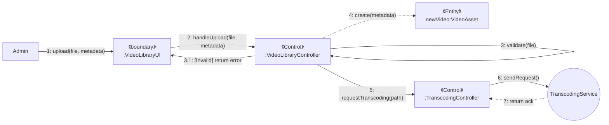
```mermaid
graph LR
    actor[Admin] -- "1: upload(file, metadata)" --> UI[《boundary》\n :VideoLibraryUI]
    classDef actor fill:#ffffff,stroke:#333,stroke-width:1px;
    
    UI -- "2: handleUpload(file, metadata)" --> Controller[《Control》\n:VideoLibraryController]
    
    Controller -- "3: validate(file)" --> Controller
    Controller -- "3.1: [Invalid] return error" --> UI
    
    Controller -. "4: create(metadata)" .-> Asset[《Entity》\nnewVideo:VideoAsset]
    
    Controller -- "5: requestTranscoding(path)" --> Proxy[《Control》\n:TranscodingController]
    
    Proxy -- "6: sendRequest()" --> ExtService((TranscodingService))
    ExtService -. "7: return ack" .-> Proxy
```


#### 4.2 类图

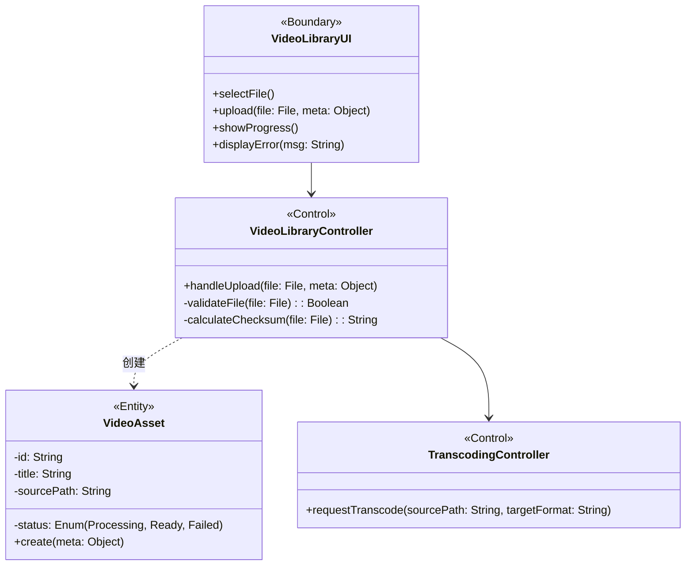
```mermaid
classDiagram
    class VideoLibraryUI {
        <<Boundary>>
        +selectFile()
        +upload(file: File, meta: Object)
        +showProgress()
        +displayError(msg: String)
    }

    class VideoLibraryController {
        <<Control>>
        +handleUpload(file: File, meta: Object)
        -validateFile(file: File): Boolean
        -calculateChecksum(file: File): String
    }

    class TranscodingController {
        <<Control>>
        +requestTranscode(sourcePath: String, targetFormat: String)
    }

    class VideoAsset {
        <<Entity>>
        -id: String
        -title: String
        -status: Enum (Processing, Ready, Failed)
        -sourcePath: String
        +create(meta: Object)
    }

    %% 关系定义
    VideoLibraryUI --> VideoLibraryController
    VideoLibraryController ..> VideoAsset : 创建
    VideoLibraryController --> TranscodingController
```

#### 4.3 顺序图

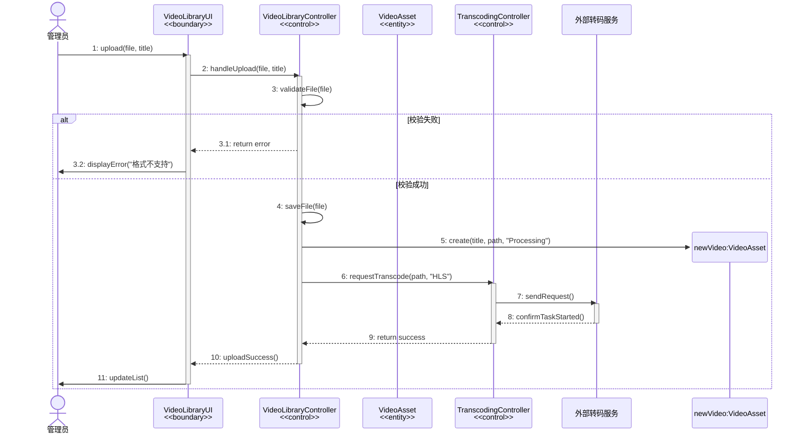
```mermaid
sequenceDiagram
    actor Admin as 管理员
    participant UI as VideoLibraryUI<br/><<boundary>>
    participant Controller as VideoLibraryController<br/><<control>>
    participant Asset as VideoAsset<br/><<entity>>
    participant Proxy as TranscodingController<br/><<control>>
    participant Ext as 外部转码服务
    
    Admin->>UI: 1: upload(file, title)
    activate UI
    UI->>Controller: 2: handleUpload(file, title)
    activate Controller
    
    Controller->>Controller: 3: validateFile(file)
    
    alt 校验失败
        Controller-->>UI: 3.1: return error
        UI->>Admin: 3.2: displayError("格式不支持")
    else 校验成功
        Controller->>Controller: 4: saveFile(file)
        
        create participant NewAsset as newVideo:VideoAsset
        Controller->>NewAsset: 5: create(title, path, "Processing")
        
        Controller->>Proxy: 6: requestTranscode(path, "HLS")
        activate Proxy
        Proxy->>Ext: 7: sendRequest()
        activate Ext
        Ext-->>Proxy: 8: confirmTaskStarted()
        deactivate Ext
        Proxy-->>Controller: 9: return success
        deactivate Proxy
        
        Controller-->>UI: 10: uploadSuccess()
        deactivate Controller
        UI->>Admin: 11: updateList()
        deactivate UI
    end
```


### 5. 用例片段：管理视频库——删除视频

**范围：** 管理员请求删除指定的视频资源。系统需先验证该视频是否正在被房间播放，若未播放则执行物理文件删除和逻辑记录销毁。

**前置条件：** 管理员已登录，且视频库中存在目标视频。

**1. 根据UC-05 管理视频库（备选流A1 删除）用例描述提取候选类**

 ```text
“1.系统验证该视频是否正在‘当前播放’状态”——> 房间状态实体（RoomState），维护当前正在播放的资源ID。
“4.系统执行物理删除操作...5.系统执行逻辑删除操作”——> 视频库控制器（VideoLibraryController），协调检查与删除逻辑。
“5.销毁对应的视频资产记录”——> 视频资产实体（VideoAsset）。

 ```

**2. 健壮性分析**

| **关键对象类型** | **类名称**                 | **职责**                                                     |
| ---------------- | -------------------------- | ------------------------------------------------------------ |
| 边界对象         | **VideoLibraryUI**         | **视频库界面**，提供删除按钮，显示确认对话框及操作结果。     |
| 控制对象         | **VideoLibraryController** | **视频库控制器**，负责删除逻辑的核心协调。先检查 `RoomState` 确认占用情况，再执行文件系统的物理删除和数据库的逻辑删除。 |
| 实体对象         | **RoomState**              | **房间状态**，记录当前房间正在播放的 `currentVideoId`，用于依赖检查。 |
| 实体对象         | **VideoAsset**             | **视频资产**，代表视频数据记录，响应删除操作。               |

**3. 健壮性交互流程**

1. 管理员在 `VideoLibraryUI` 点击删除。
2. UI 弹出确认提示，管理员确认。
3. UI 调用 `VideoLibraryController` 执行删除。
4. `VideoLibraryController` 访问 `RoomState` 检查目标视频是否为 `currentVideoId`。
5. 若正在播放，返回错误提示。
6. 若未播放，`VideoLibraryController` 删除磁盘文件。
7. `VideoLibraryController` 调用 `VideoAsset` 销毁数据库记录。
8. UI 刷新列表。


### 3. 交互建模
**通信图**

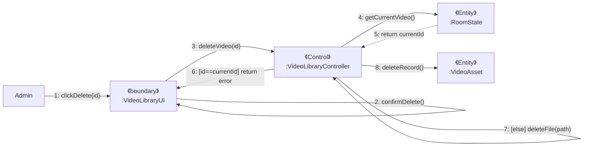
```mermaid
graph LR
    actor[Admin] -- "1: clickDelete(id)" --> UI[《boundary》\n :VideoLibraryUI]
    classDef actor fill:#ffffff,stroke:#333,stroke-width:1px;
    
    UI -- "2: confirmDelete()" --> UI
    UI -- "3: deleteVideo(id)" --> Controller[《Control》\n:VideoLibraryController]
    
    Controller -- "4: getCurrentVideo()" --> State[《Entity》\n:RoomState]
    State -. "5: return currentId" .-> Controller
    
    Controller -- "6: [id==currentId] return error" --> UI
    
    Controller -- "7: [else] deleteFile(path)" --> Controller
    Controller -- "8: deleteRecord()" --> Asset[《Entity》\n:VideoAsset]
```

**通信图->类图**

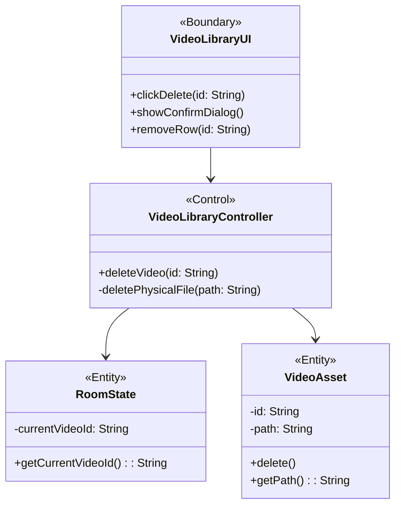
```mermaid
classDiagram
    class VideoLibraryUI {
        <<Boundary>>
        +clickDelete(id: String)
        +showConfirmDialog()
        +removeRow(id: String)
    }

    class VideoLibraryController {
        <<Control>>
        +deleteVideo(id: String)
        -deletePhysicalFile(path: String)
    }

    class RoomState {
        <<Entity>>
        -currentVideoId: String
        +getCurrentVideoId(): String
    }

    class VideoAsset {
        <<Entity>>
        -id: String
        -path: String
        +delete()
        +getPath(): String
    }

    %% 关系定义
    VideoLibraryUI --> VideoLibraryController
    VideoLibraryController --> RoomState
    VideoLibraryController --> VideoAsset
```


**顺序图**

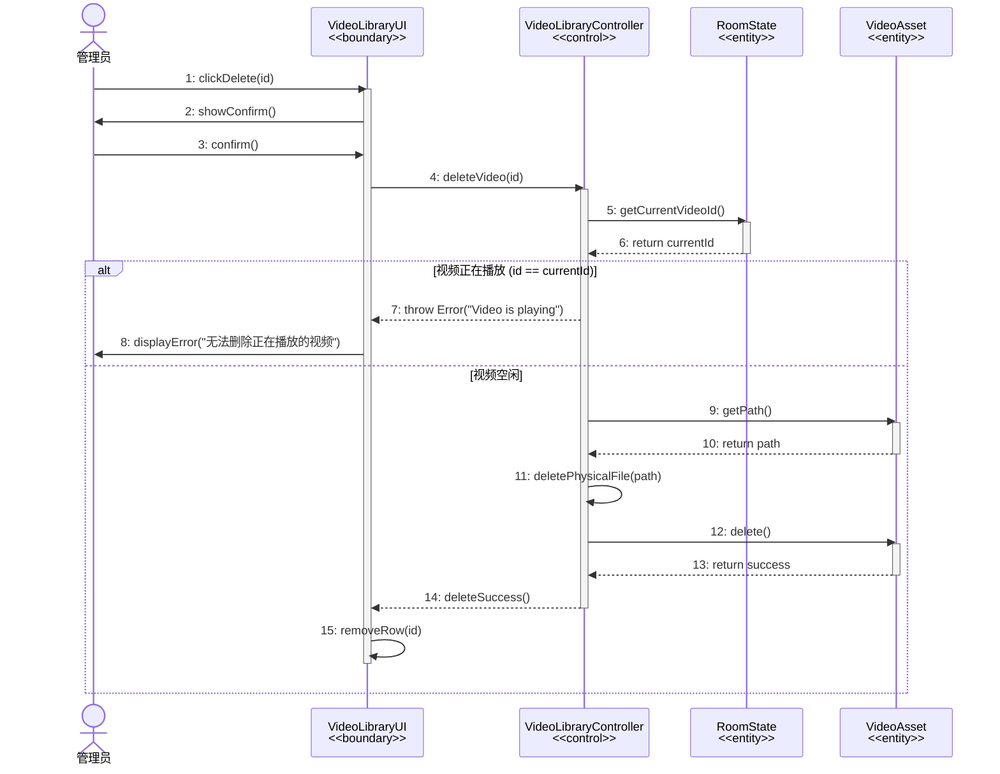
```mermaid
sequenceDiagram
    actor Admin as 管理员
    participant UI as VideoLibraryUI<br/><<boundary>>
    participant Controller as VideoLibraryController<br/><<control>>
    participant State as RoomState<br/><<entity>>
    participant Asset as VideoAsset<br/><<entity>>
    
    Admin->>UI: 1: clickDelete(id)
    activate UI
    UI->>Admin: 2: showConfirm()
    Admin->>UI: 3: confirm()
    
    UI->>Controller: 4: deleteVideo(id)
    activate Controller
    
    Controller->>State: 5: getCurrentVideoId()
    activate State
    State-->>Controller: 6: return currentId
    deactivate State
    
    alt 视频正在播放 (id == currentId)
        Controller-->>UI: 7: throw Error("Video is playing")
        UI->>Admin: 8: displayError("无法删除正在播放的视频")
    else 视频空闲
        Controller->>Asset: 9: getPath()
        activate Asset
        Asset-->>Controller: 10: return path
        deactivate Asset
        
        Controller->>Controller: 11: deletePhysicalFile(path)
        
        Controller->>Asset: 12: delete()
        activate Asset
        Asset-->>Controller: 13: return success
        deactivate Asset
        
        Controller-->>UI: 14: deleteSuccess()
        deactivate Controller
        UI->>UI: 15: removeRow(id)
        deactivate UI
    end
```

### 4. 合并后的类图 (管理视频库：上传与删除)

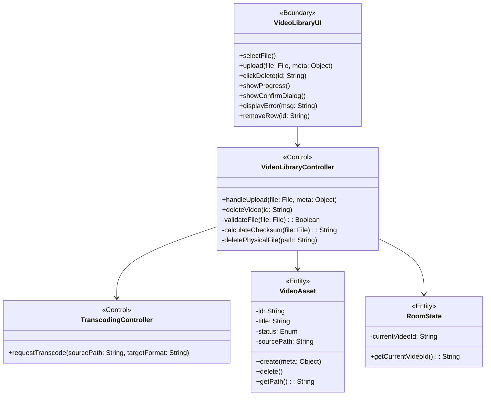
```mermaid
classDiagram
    class VideoLibraryUI {
        <<Boundary>>
        +selectFile()
        +upload(file: File, meta: Object)
        +clickDelete(id: String)
        +showProgress()
        +showConfirmDialog()
        +displayError(msg: String)
        +removeRow(id: String)
    }

    class VideoLibraryController {
        <<Control>>
        +handleUpload(file: File, meta: Object)
        +deleteVideo(id: String)
        -validateFile(file: File): Boolean
        -calculateChecksum(file: File): String
        -deletePhysicalFile(path: String)
    }

    class TranscodingController {
        <<Control>>
        +requestTranscode(sourcePath: String, targetFormat: String)
    }

    class VideoAsset {
        <<Entity>>
        -id: String
        -title: String
        -status: Enum
        -sourcePath: String
        +create(meta: Object)
        +delete()
        +getPath(): String
    }

    class RoomState {
        <<Entity>>
        -currentVideoId: String
        +getCurrentVideoId(): String
    }

    %% 关系定义
    VideoLibraryUI --> VideoLibraryController
    VideoLibraryController --> TranscodingController
    VideoLibraryController --> VideoAsset
    VideoLibraryController --> RoomState
```


---

## 用例：参与互动

### 用例片段：参与互动——发送消息

**范围：** 观众在消息输入框编辑并发送消息，系统验证消息内容的合规性，生成消息实体，并检索当前房间的观众列表，将消息广播给所有在线成员 。

**前置条件：** 用户已进入房间。

**1.根据UC-08 参与互动用例描述提取候选类**

```
“1.当参与者观众进入观影厅时，开始启动用例。”——> 观影厅（房间类） 观众（Audience）
“6.观众在消息输入框中编辑消息内容”——>聊天输入面板UI类

“7.观众点击发送按钮。”——>聊天输入面板UI类的职责：将输入的消息发送给系统; 消息应该不只包含内容，还应该包含发送方id，房间id（发往哪去）。所以还要有个消息实体。

"系统接收输入消息，并且执行子流“验证消息内容”。——>消息处理类，职责消息内容长度验证，验证通过后创建消息实体

“系统执行子流“广播消息”——>业务消息分发(消息分发类),职责：获取观众列表，分发所有消息给用户。

备选流中
"'验证消息内容'如果失败，则系统阻止消息发送，并且在输入框附近显示对应的错误提示。"-->消息内容过长时，边界类需要向用户提示.

```


**2.健壮性分析**

| 关键对象类型 | 类名称            | 职责                                                         |
| ------------ | ----------------- | ------------------------------------------------------------ |
| 边界对象     | ChatInputPanelUI  | **聊天输入面板**，用户与系统交互的界面，负责接收用户的输入，并将数据传递给**MessageController** |
| 控制对象     | MessageController    | **通用消息处理器**，负责协调消息的处理流程。它执行子流 S1 (验证消息内容)，如果不合法则拒绝，合法则实例化消息对象 。 |
| 控制对象     | MessageDispatchController | **通用消息分发器**，负责执行子流 S2 (广播消息)。它需要获取接收者列表并将消息分发出去 。 |
| 实体对象     | Message           | 封装消息数据（内容、发送者、时间戳、房间号）。               |
| 实体对象     | ScreeningRoom          | 维护当前房间的状态，特别是 **子流S2** 中提到的“获取当前观影厅房间聊天区中的观众列表”需要访问此实体 。 |


**3.健壮性交互流程**

1. 用户在 `ChatInputPanelUI` 点击发送。
2. UI 通知 `MessageController` 处理。
3. `MessageController` 验证内容 (Subflow S1: 长度<=1024)
4. 验证通过后，`MessageController` 创建 `Message` 实体。
5. `MessageController` 调用 `MessageDispatchController` 进行分发。
6. `MessageDispatchController` 向 `ScreeningRoom` 实体请求当前观众列表 (Subflow S2) 。
7. `MessageDispatchController` 执行广播。


#### 交互建模

**通信图**

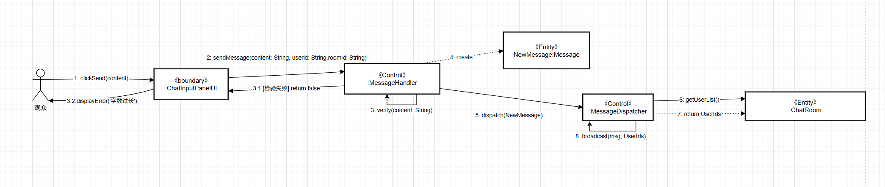


#### 通信图->类图


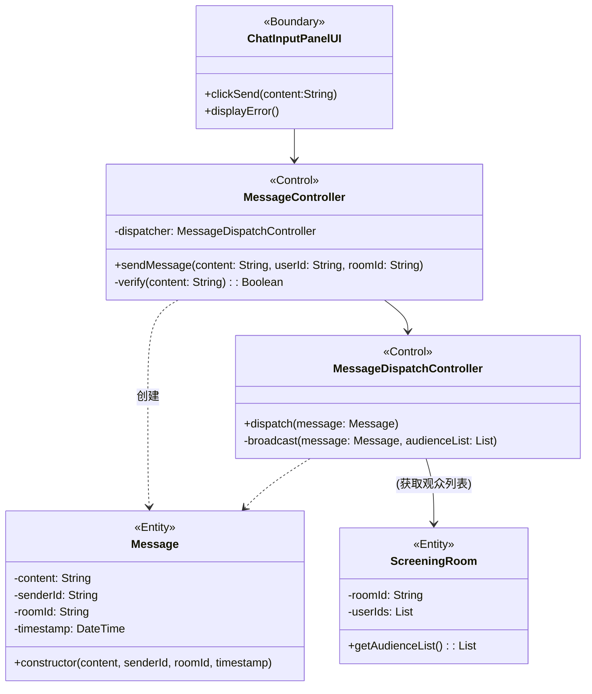
```mermaid
classDiagram
    class ChatInputPanelUI {
        <<Boundary>>
        +clickSend(content:String)
        +displayError()
    }

    class MessageController {
        <<Control>>
        -dispatcher: MessageDispatchController
        +sendMessage(content: String, userId: String, roomId: String)
        -verify(content: String): Boolean
    }

    class MessageDispatchController {
        <<Control>>
        +dispatch(message: Message)
        -broadcast(message: Message, audienceList: List)
    }

    class Message {
        <<Entity>>
        -content: String
        -senderId: String
        -roomId: String
        -timestamp: DateTime
        +constructor(content, senderId, roomId, timestamp)
    }

    class ScreeningRoom {
        <<Entity>>
        -roomId: String
        -userIds: List<String>
        +getAudienceList(): List<String>
    }

    %% 关系定义
    ChatInputPanelUI --> MessageController
    MessageController --> MessageDispatchController
    MessageController ..> Message : 创建
    MessageDispatchController ..> Message : 
    MessageDispatchController --> ScreeningRoom : (获取观众列表)
```


#### 顺序图

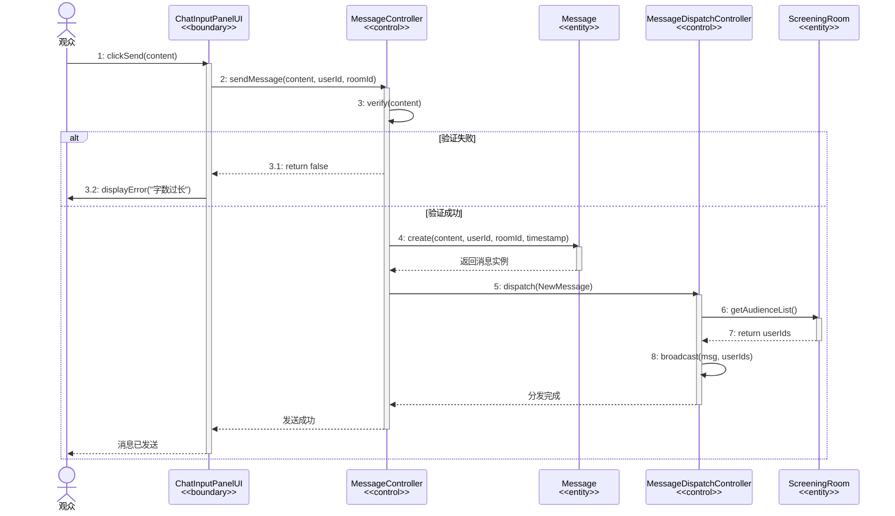
```mermaid
sequenceDiagram
    actor User as 观众
    participant UI as ChatInputPanelUI<br/><<boundary>>
    participant Controller as MessageController<br/><<control>>
    participant Msg as Message<br/><<entity>>
    participant Dispatcher as MessageDispatchController<br/><<control>>
    participant Room as ScreeningRoom<br/><<entity>>
    
    User->>UI: 1: clickSend(content)
    activate UI
    UI->>Controller: 2: sendMessage(content, userId, roomId)
    activate Controller
    Controller->>Controller: 3: verify(content)
    
    alt 验证失败
        Controller-->>UI: 3.1: return false
        UI->>User: 3.2: displayError("字数过长")
    else 验证成功
        Controller->>Msg: 4: create(content, userId, roomId, timestamp)
        activate Msg
        Msg-->>Controller: 返回消息实例
        deactivate Msg
        
        Controller->>Dispatcher: 5: dispatch(NewMessage)
        activate Dispatcher
        Dispatcher->>Room: 6: getAudienceList()
        activate Room
        Room-->>Dispatcher: 7: return userIds
        deactivate Room
        Dispatcher->>Dispatcher: 8: broadcast(msg, userIds)
        Dispatcher-->>Controller: 分发完成
        deactivate Dispatcher
        Controller-->>UI: 发送成功
        deactivate Controller
        UI-->>User: 消息已发送
        deactivate UI
    end
```

### 二、用例片段：参与互动——接收消息

**范围：** 系统接收消息，检测当前弹幕功能的状态，然后将消息传递给对应界面进行渲染。

**1.根据UC-08 参与互动用例描述提取候选类**

```
“系统检测所有参与者的消息发送情况”——>消息监听类（MessageListenerController）、消息类（Message）、观众（Audience）
“参与者通过互动设置面板调节弹幕功能开关”——>互动设置面板类（InteractionSettingsUI）
“弹幕功能的开启状态”——>弹幕管理类（DanmuController）
“系统获取以下信息并且在房间聊天区中展示”。——>消息列表界面类（MessageListUI）
“弹幕功能开启，系统将最新的消息展示到屏幕上”——>弹幕界面类（DanmuUI）
```


**2.健壮性分析**

| 关键对象类型 | 类名称                | 职责                                                         |
| ------------ | --------------------- | ------------------------------------------------------------ |
| 边界对象     | InteractionSettingsUI | **互动设置面板**，用户与系统交互的界面，负责展示弹幕功能的开关状态、传递弹幕功能开关状态改变信息 |
| 控制对象     | DanmuController          | **弹幕管理器**，负责检查、设置弹幕功能状态，传递消息给弹幕界面进行渲染 。 |
| 边界对象     | MessageListUI         | **消息列表界面**，负责在房间聊天区中渲染所有消息 。              |
| 实体对象     | Message               | 封装消息数据（内容、发送者、时间戳）。                       |
| 边界对象     | DanmuUI               | **弹幕界面**，负责将消息渲染成弹幕。                         |
| 控制对象     | MessageListenerController       | **消息监听器**，负责接收并创建消息实体，并将消息在系统内传递 |


**3.健壮性交互流程**

1. `MessageListenerController`接收并且创建`Message`实体
2. 参与者通过`InteractionSettingsUI`设置弹幕功能状态
3. `MessageListenerController`将创建的`Message`传递给`DanmuController`、`MessageListUI`
4. `MessageListUI`渲染消息，`DanmuController`检查弹幕功能状态，并向`DanmuUI`传递渲染弹幕的指令
5. 如果弹幕功能开启，`DanmuUI`渲染弹幕

#### 交互建模

**接收消息的通信图**
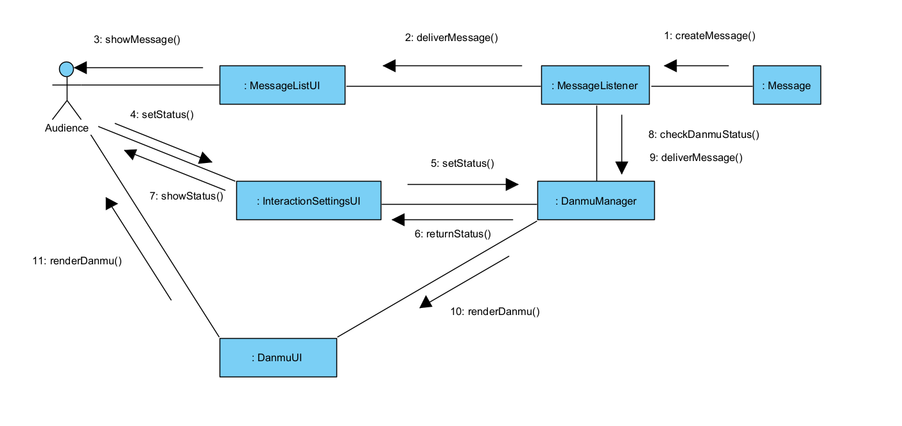
**通信图——>类图**
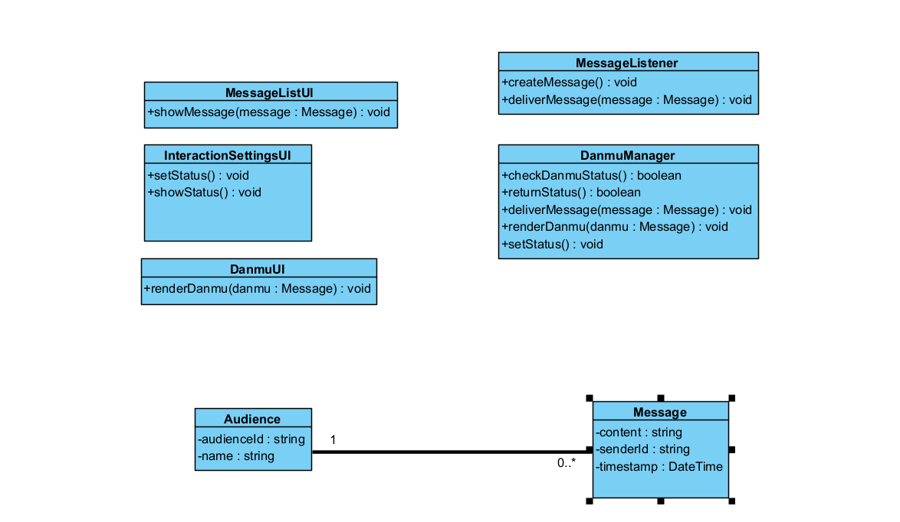
**接收消息的顺序图**
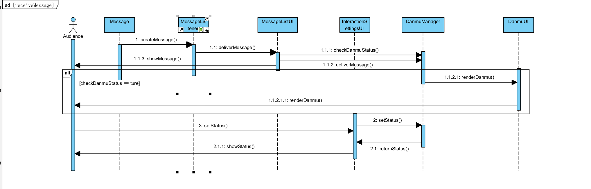

### 整合类图	

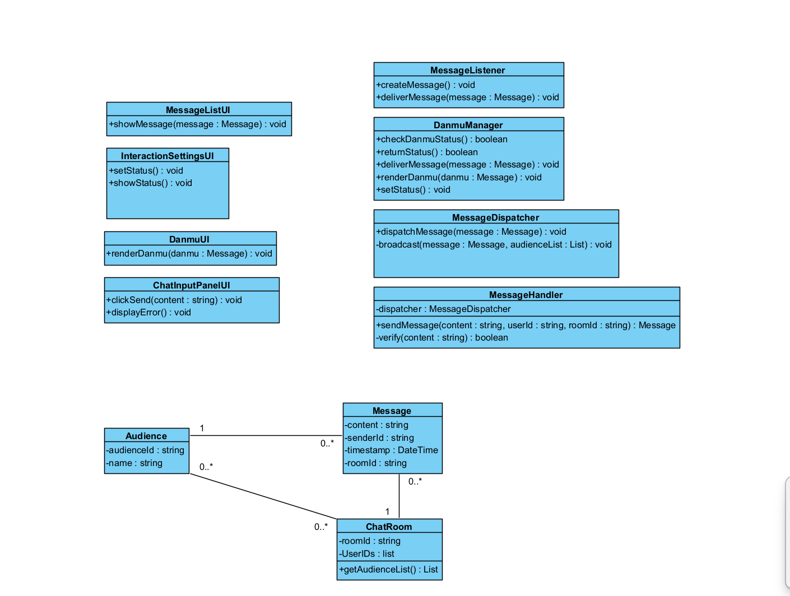


## 用例：配置房间

### 用例片段：管理成员——踢出普通用户

**范围：** 系统验证管理员身份与操作对象权限，弹出确认提示，管理员确认后，系统发送踢出请求至服务器，更新房间成员列表，强制目标用户退出，同时记录操作日志。  
**前置条件：** 用户已登录。

### 1. 根据UC-06管理成员用例描述提取候选类

- "对应 “参与者” 角色，当管理员进入成员管理界面（观影厅 / 房间类场景映射）时" ——> 管理员（User）  
- “选择目标用户（selectUser (userId)）、点击踢出按钮（clickKick ()）” ——> 成员管理界面（UI）  
- “处理踢出请求（kickUser(userId)）” ——> 成员管理控制器（MemberManagementController）  
- “校验管理员身份（是否为当前房间有权限的管理员）” ——> 权限验证器（PermissionController）  
- “响应处理器请求：返回目标用户角色，接收成员列表更新指令” ——> 观影房间（ScreeningRoom - Entity）  
- “对应 “消息实体”” ——> 操作日志（OperationLog - Entity）  
- “接收处理器的踢出请求, 向服务器发送操作指令，执行实际的踢出动作” ——> 服务器通信器（ServerCommunicationController）  

### 2. 健壮性分析

#### 边界类（Boundary）

- MemberManagementUI：负责接收管理员的选择、点击等交互操作，展示确认提示与结果反馈。

#### 控制类（Control）

- MemberManagementController：协调踢出用户的完整流程，调用权限验证、服务器通信、日志记录等功能。
- PermissionController：专门负责验证管理员身份、操作对象是否为普通用户等权限校验逻辑。

#### 实体类（Entity）

- ScreeningRoom：维护房间成员列表、记录成员角色（管理员 / 普通用户）及房间状态（正常 / 已解散）。
- OperationLog：封装踢出操作的相关信息（操作人 ID、目标用户 ID、操作时间、操作类型、房间 ID）。 

### 3. 健壮性交互流程

1. 管理员在 MemberManagementUI 选择目标普通用户并点击 “踢出” 按钮。
2. UI 通知 MemberManagementController 处理踢出操作。
3. MemberManagementController 调用 PermissionController 验证权限（Subflow S1：验证管理员身份、目标用户为普通用户、当前成员列表状态正常）。
4. 权限验证通过后，MemberManagementController 向 ScreeningRoom 请求当前房间状态（Subflow S2：确认房间为 “正常可用” 状态）。
5. MemberManagementController 调用 ServerCommunicationController 发送踢出请求至服务器。
6. ServerCommunicationController 执行踢出操作并返回结果，MemberManagementController 调用 ScreeningRoom 更新成员列表（Subflow S3：移除目标用户 ID、同步成员数量）。
7. MemberManagementController 调用 OperationLog 实体记录踢出操作日志（Subflow S4：记录操作人 ID、目标用户 ID、操作时间、操作类型）。
8. MemberManagementController 将操作结果反馈至 MemberManagementUI，UI 向管理员展示 “踢出成功” 提示

### 4. 画通信图


### 5. 画类图


### 6. 画序列图


# 观影室创建与加入

## 一、 UC-01 创建观影室 

用例片段：创建观影室 ———— 初始化与权限分配

范围：用户在界面提交创建请求，系统验证用户权限与房间配额，实例化房间对象，并确立房主身份。

前置条件：用户已登录。

### 1. 根据 UC-01 创建观影室用例描述提取候选类

- “用户填写房间名称、设置密码...” ——> **创建房间面板UI类 (`CreateRoomUI`)**
- “系统验证请求参数...检测用户已达到最大持有的房间数量限制” ——> **房间生命周期控制器 (`RoomLifecycleControl`)**，职责：协调创建流程，执行业务规则校验。
- “系统在数据库中创建一个新的观影室实例” ——> **观影室实体类 (`ScreeningRoom`)**，职责：封装房间数据（ID、名称、密码）。
- “将发起用户指定为该房间的房主” ——> **用户实体类 (`User`)**，职责：维护用户角色与已创建房间列表。

### 2. 健壮性分析

| **关键对象类型** | **类名称**             | **职责**                                                     |
| ---------------- | ---------------------- | ------------------------------------------------------------ |
| **边界对象**     | `CreateRoomUI`         | 创建房间的交互界面，负责接收房间名、密码、模式设置，并向用户反馈创建结果。 |
| **控制对象**     | `RoomLifecycleControl` | 房间生命周期控制器。负责协调创建逻辑：1.向User实体查询已创建数并校验；2.实例化ScreeningRoom；3.关联房主权限。 |
| **实体对象**     | `User`                 | 封装用户信息。提供“已创建房间数”数据供校验，并记录用户与新房间的房主关系。 |
| **实体对象**     | `ScreeningRoom`        | 封装房间核心数据（ID, Name, Password, Config）。             |

### 3. 健壮性交互流程

1. 用户在 `CreateRoomUI` 输入配置并点击创建。
2. UI 通知 `RoomLifecycleControl` 处理请求。
3. `RoomLifecycleControl` 访问 `User` 实体，验证创建数量是否超限 (业务规则)。
4. 验证通过后，`RoomLifecycleControl` 实例化一个新的 `ScreeningRoom` 对象。
5. `RoomLifecycleControl` 调用 `User` 实体，更新其身份为该房间房主。
6. 系统返回新房间ID至 `CreateRoomUI`，跳转进入。

### 4. 交互建模

#### 通信图

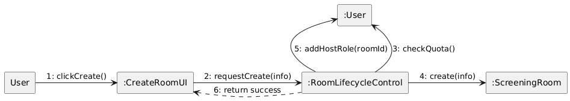

#### 顺序图 

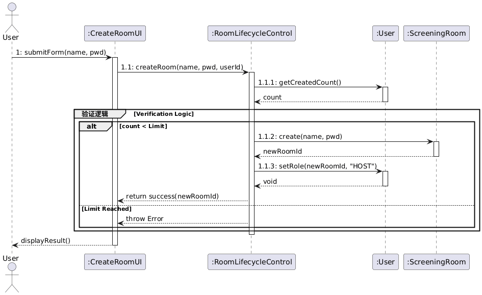

#### 5. 通信图 -> 类图推导

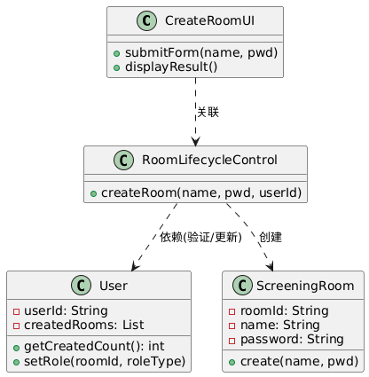

## 二、 UC-02 加入观影室 

**用例片段**：加入观影室 ———— 准入验证与状态同步 **范围**：用户输入房间号，系统验证房间是否存在、是否满员及密码正确性，通过后将用户加入列表并同步当前播放状态。 **前置条件**：用户已知晓房间ID。

### 1. 根据 UC-02 加入观影室用例描述提取候选类

- “用户向系统发起加入指定观影室的请求” ——> **加入房间面板UI类 (`JoinRoomUI`)**
- “系统验证加入条件（满员、密码）” ——> **加入请求控制器 (`JoinAccessControl`)**，职责：负责准入控制逻辑。
- “系统将用户添加到该房间的在线成员列表中” ——> **观影室实体类 (`ScreeningRoom`)**，职责：维护成员列表、密码哈希、人数上限。
- “系统获取房间当前的播放状态...同步给用户” ——> **房间状态实体类 (`RoomState`)**，职责：维护播放进度、视频源等动态数据（这是教材中强调的将动态状态与静态数据分离的设计）。

### 2. 健壮性分析

| **关键对象类型** | **类名称**          | **职责**                                                     |
| ---------------- | ------------------- | ------------------------------------------------------------ |
| **边界对象**     | `JoinRoomUI`        | 加入界面，接收房间ID和密码，初始化播放器组件。               |
| **控制对象**     | `JoinAccessControl` | 加入控制器。1.验证房间存在；2.验证密码；3.验证人数；4.若通过，触发成员添加和状态获取。 |
| **实体对象**     | `ScreeningRoom`     | 存储静态属性（密码、最大人数、成员列表）。                   |
| **实体对象**     | `RoomState`         | 存储动态属性（当前视频、时间戳、播放/暂停状态）。            |

1. 用户在 `JoinRoomUI` 输入房间号和密码。
2. UI 请求 `JoinAccessControl` 处理。
3. `JoinAccessControl` 访问 `ScreeningRoom` 获取配置（密码、人数）。
4. 控制器执行验证（Subflow S1: 密码匹配 & 未满员）。
5. 验证通过后，控制器调用 `ScreeningRoom` 添加成员。
6. 控制器访问 `RoomState` 获取当前播放快照（视频、进度）。
7. 系统返回同步数据包至 `JoinRoomUI`，客户端播放器立即同步。

### 4. 交互建模

#### 通信图

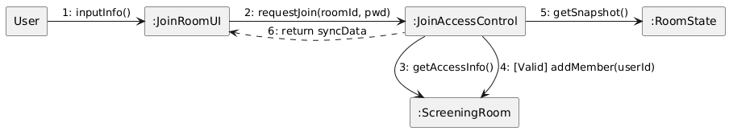

#### 顺序图

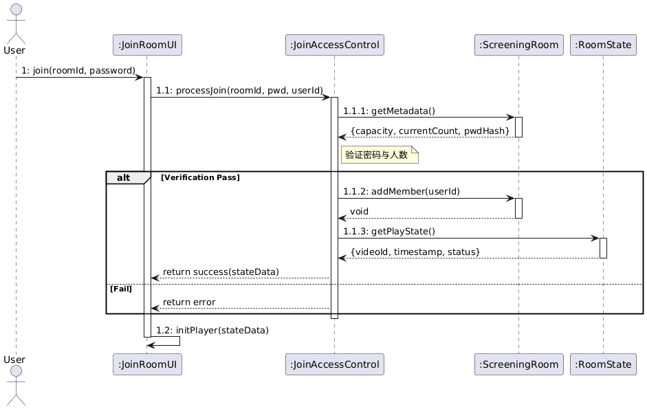

#### 5. 通信图 -> 类图推导

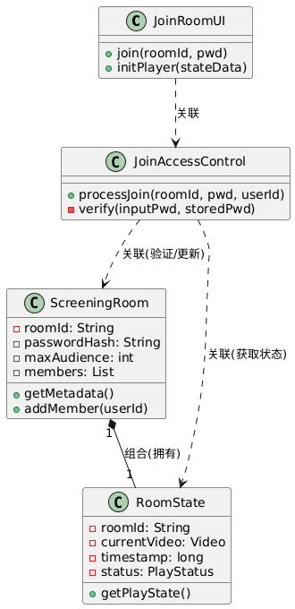


#### 整合类图

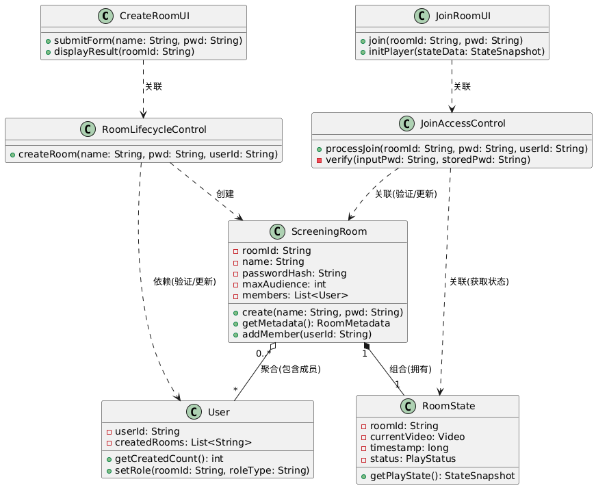


## 最终合并类图

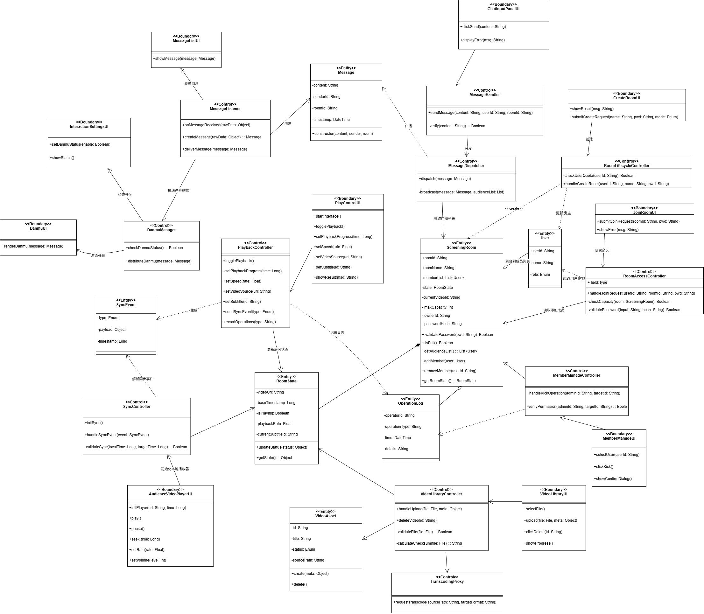


## 最终类介绍，以此图和介绍为准

---

### Boundary（界面/交互）类

#### PlayControlUI

- 职责：播放控制面板的界面层，负责采集用户操作并展示操作结果。
- 方法：
    - `startInterface()`：初始化/启动播放控制界面（加载控件、绑定事件等）。
    - `togglePlayback()`：用户点击“播放/暂停”按钮的 UI 入口。
    - `setPlaybackProgress(time: Long)`：用户拖动进度条或设置播放位置；`time` 为目标播放时间（通常是毫秒或秒，需在实现中统一单位）。
    - `setSpeed(rate: Float)`：用户调整播放倍速；`rate` 为倍速（如 0.5/1.0/1.25/2.0）。
    - `setVideoSource(url: String)`：设置/切换当前播放的视频地址。
    - `setSubtitle(id: String)`：设置/切换字幕资源；`id` 为字幕资源标识。
    - `showResult(msg: String)`：展示操作提示/结果信息（成功、失败原因等）。

#### AudienceVideoPlayerUI

- 职责：观众侧播放器界面，负责本地播放行为与基础控制。
- 方法：
    - `initPlayer(url: String, time: Long)`：初始化播放器并定位到指定播放位置；`url` 为视频地址，`time` 为起播位置。
    - `play()`：开始播放。
    - `pause()`：暂停播放。
    - `seek(time: Long)`：跳转到指定时间点。
    - `setRate(rate: Float)`：设置播放倍速。
    - `setVolume(level: Int)`：设置音量；`level` 通常为 0~100（具体范围在实现中定义）。

#### ChatInputPanelUI

- 职责：聊天输入面板，负责发送入口与错误提示。
- 方法：
    - `clickSend(content: String)`：点击发送；`content` 为用户输入的消息文本。
    - `displayError(msg: String)`：展示发送失败/校验失败等错误。

#### MessageListUI

- 职责：消息列表展示区域。
- 方法：
    - `showMessage(message: Message)`：将一条 `Message` 渲染到消息列表中。

#### DanmuUI

- 职责：弹幕展示层，将消息以弹幕形式呈现。
- 方法：
    - `renderDanmu(message: Message)`：将 `Message` 渲染为弹幕并播放滚动动画（具体实现细节不在类图中约束）。

#### InteractionSettingsUI

- 职责：互动设置界面，例如弹幕开关等。
- 方法：
    - `setDanmuStatus(enable: Boolean)`：设置弹幕启用状态；`enable=true` 开启，`false` 关闭。
    - `showStatus()`：展示当前互动设置状态（如“弹幕已开启/关闭”）。

#### VideoLibraryUI

- 职责：视频库界面（上传/删除/查看进度）。
- 方法：
    - `selectFile()`：触发文件选择。
    - `upload(file: File, meta: Object)`：上传选中文件与元信息（如标题、标签等，结构未细化）。
    - `clickDelete(id: String)`：用户点击删除某个视频资源；`id` 为视频资源标识。
    - `showProgress()`：展示上传/转码等进度。

#### MemberManageUI

- 职责：成员管理界面（如房主/管理员执行踢人）。
- 方法：
    - `selectUser(userId: String)`：选择需要操作的成员。
    - `clickKick()`：点击“踢出”操作。
    - `showConfirmDialog()`：展示二次确认弹窗（避免误操作）。

#### CreateRoomUI

- 职责：创建房间界面。
- 方法：
    - `submitCreateRequest(name: String, pwd: String, mode: Enum)`：提交创建请求；`name` 房间名，`pwd` 房间密码，`mode` 房间模式（枚举，具体取值待实现定义）。
    - `showResult(msg: String)`：展示创建结果。

#### JoinRoomUI

- 职责：加入房间界面。
- 方法：
    - `submitJoinRequest(roomId: String, pwd: String)`：提交加入请求；`roomId` 房间号，`pwd` 房间密码。
    - `showError(msg: String)`：展示加入失败原因。

---

### Control（控制/业务协调）类

#### PlaybackController

- 职责：播放控制的业务协调层，将 UI 操作转为房间内同步事件，并记录操作。
- 方法：
    - `togglePlayback()`：处理播放/暂停切换，并触发同步。
    - `setPlaybackProgress(time: Long)`：处理进度跳转，并触发同步。
    - `setSpeed(rate: Float)`：处理倍速调整，并触发同步。
    - `setVideoSource(url: String)`：处理切换视频源，并触发同步。
    - `setSubtitle(id: String)`：处理切换字幕，并触发同步。
    - `sendSyncEvent(type: Enum)`：向同步/通信层发送同步事件；`type` 表示事件类型（播放、暂停、seek、倍速、切源、切字幕等）。
    - `recordOperations(type: String)`（private）：记录一次操作到日志（映射到 `OperationLog`）。

#### SyncController

- 职责：同步控制器，负责接收同步事件并驱动本地播放器与房间状态更新。
- 方法：
    - `initSync()`：初始化同步机制（订阅事件、初始化状态等）。
    - `handleSyncEvent(event: SyncEvent)`：处理同步事件；根据事件类型更新播放状态/进度/倍速/字幕等。
    - `validateSync(localTime: Long, targetTime: Long): Boolean`（private）：校验本地时间与目标时间差异是否需要强制同步；返回 `true` 表示需要同步或同步有效。

#### MessageHandler

- 职责：消息发送处理器，负责对外提供“发送消息”能力并做基本校验。
- 方法：
    - `sendMessage(content: String, userId: String, roomId: String)`：发送聊天/互动消息；`content` 消息内容，`userId` 发送者，`roomId` 所在房间。
    - `verify(content: String): Boolean`（private）：校验消息内容（如非空、长度限制、敏感词等策略由实现定义）。

#### MessageDispatcher

- 职责：消息分发器，将消息广播给房间内观众列表。
- 方法：
    - `dispatch(message: Message)`：分发入口，决定广播范围与策略。
    - `broadcast(message: Message, audienceList: List)`（private）：向指定观众列表广播消息（列表元素类型在类图中未细化，通常为 `List<User>` 或连接会话）。

#### MessageListener

- 职责：消息接收监听器，负责把网络/通信层原始数据转成领域对象并投递。
- 方法：
    - `onMessageReceived(rawData: Object)`：收到原始消息数据的回调入口。
    - `createMessage(rawData: Object): Message`：将 `rawData` 解析/映射为 `Message` 实体。
    - `deliverMessage(message: Message)`：将 `Message` 投递给展示层/弹幕管理等后续处理。

#### DanmuManager

- 职责：弹幕业务管理，决定是否投放弹幕以及如何分发。
- 方法：
    - `checkDanmuStatus(): Boolean`：查询弹幕开关状态（可能来自 `InteractionSettingsUI` 的设置或房间配置）。
    - `distributeDanmu(message: Message)`：将可投放的消息交给 `DanmuUI` 渲染或进行分发控制。

#### VideoLibraryController

- 职责：视频库业务控制，处理上传、删除以及文件校验等。
- 方法：
    - `handleUpload(file: File, meta: Object)`：处理上传流程（校验、入库、触发转码等）。
    - `deleteVideo(id: String)`：删除视频资源。
    - `validateFile(file: File): Boolean`（private）：校验文件合法性（格式、大小、时长等由实现定义）。
    - `calculateChecksum(file: File): String`（private）：计算文件校验和（用于去重/完整性校验）。

#### TranscodingProxy

- 职责：转码代理/适配层，对接转码服务。
- 方法：
    - `requestTranscode(sourcePath: String, targetFormat: String)`：请求将 `sourcePath` 源文件转码为 `targetFormat`（如 mp4/hls 等）。

#### MemberManageController

- 职责：成员管理控制器，处理踢人等管理操作，并进行权限校验。
- 方法：
    - `handleKickOperation(adminId: String, targetId: String)`：执行踢人操作；`adminId` 操作者，`targetId` 被踢者。
    - `verifyPermission(adminId: String, targetId: String): Boolean`（private）：校验操作者是否有权限对目标执行踢人。

#### RoomLifecycleController

- 职责：房间生命周期控制器，负责创建房间等生命周期事件。
- 方法：
    - `handleCreateRoom(userId: String, name: String, pwd: String)`：创建房间并初始化房间状态；`userId` 为房主。
    - `checkUserQuota(userId: String): Boolean`（private）：检查用户是否满足创建配额/限制（如创建次数、权限等）。

#### RoomAccessController

- 职责：房间访问控制器，负责加入房间请求处理（容量、密码等校验）。
- 成员：
    - `field: type`：类图中保留的字段占位（具体含义未细化，可用于注入依赖/配置/服务句柄等）。
- 方法：
    - `handleJoinRequest(userId: String, roomId: String, pwd: String)`：处理用户加入房间请求。
    - `checkCapacity(room: ScreeningRoom): Boolean`（private）：检查房间容量是否允许加入。
    - `validatePassword(input: String, hash: String): Boolean`（private）：校验输入密码与存储的哈希是否匹配。

---

### Entity（领域实体/数据）类

#### ScreeningRoom

- 职责：放映厅房间实体，承载房间的成员、状态、配置等核心数据。
- 属性：
    - `roomId: String`：房间唯一标识。
    - `roomName: String`：房间名称。
    - `memberList: List<User>`：房间成员列表。
    - `state: RoomState`：房间当前播放状态。
    - `currentVideoId: String`：当前播放的视频资源标识。
    - `maxCapacity: Int`：房间最大容量。
    - `ownerId: String`：房主用户标识。
    - `passwordHash: String`：房间密码哈希（不存明文）。
- 方法：
    - `validatePassword(pwd: String): Boolean`：校验输入密码是否正确。
    - `isFull(): Boolean`：判断房间是否已满。
    - `getAudienceList(): List<User>`：获取广播/分发用的观众列表。
    - `addMember(user: User)`：新增成员。
    - `removeMember(userId: String)`：移除成员。
    - `getRoomState(): RoomState`：获取房间状态对象。

#### RoomState

- 职责：房间播放状态实体，用于同步播放进度与播放配置。
- 属性：
    - `videoUrl: String`：当前视频播放地址。
    - `baseTimestamp: Long`：基准时间戳（用于计算“从某一时刻开始播放”的同步基线）。
    - `isPlaying: Boolean`：是否处于播放中。
    - `playbackRate: Float`：当前倍速。
    - `currentSubtitleId: String`：当前字幕资源标识。
- 方法：
    - `updateStatus(status: Object)`：用外部传入的状态快照更新 `RoomState`（结构未细化）。
    - `getState(): Object`：以通用对象形式导出当前状态（用于网络传输/持久化等）。

#### User

- 职责：用户实体。
- 属性：
    - `userId: String`：用户唯一标识。
    - `name: String`：用户昵称。
    - `role: Enum`：用户角色（如房主/管理员/观众等，取值待定义）。

#### Message

- 职责：消息实体（聊天/互动/弹幕的统一载体）。
- 属性：
    - `content: String`：消息内容。
    - `senderId: String`：发送者标识。
    - `roomId: String`：所属房间标识。
    - `timestamp: DateTime`：消息产生时间。
- 方法：
    - `constructor(content, sender, room)`：构造 `Message`，将内容、发送者与房间进行绑定并生成时间戳（时间戳生成策略由实现定义）。

#### VideoAsset

- 职责：视频资源实体，表示上传到视频库的一个视频条目。
- 属性：
    - `id: String`：资源标识。
    - `title: String`：标题。
    - `status: Enum`：资源状态（如上传中、转码中、可播放、已删除等）。
    - `sourcePath: String`：源文件路径/存储地址。
- 方法：
    - `create(meta: Object)`：根据元信息创建/初始化资源记录。
    - `delete()`：标记或执行删除资源。

#### OperationLog

- 职责：操作日志实体，用于记录播放控制等关键操作。
- 属性：
    - `operatorId: String`：操作者标识。
    - `operationType: String`：操作类型（如 play/pause/seek/speed/changeSource 等）。
    - `time: DateTime`：操作发生时间。
    - `details: String`：操作细节（可存储描述或序列化后的参数）。

#### SyncEvent

- 职责：同步事件实体，用于在房间内传播播放控制事件。
- 属性：
    - `type: Enum`：事件类型（播放、暂停、seek、倍速等）。
    - `payload: Object`：事件载荷（如 time、rate、url、subtitleId 等，结构未细化）。
    - `timestamp: Long`：事件发生的时间戳（通常为毫秒级 Unix 时间戳）。
